# FeelMyRythm 아키텍처와 코드 읽기 가이드

> 대상: 이 저장소를 처음 열어 구조, 실행 경로, 핵심 불변 조건과 변경 지점을 빠르게 파악하려는 개발자

함께 읽을 문서:

- 구현된 사용자 기능: [FEATURES.md](FEATURES.md)
- 최종 사용자 조작법: [USER_GUIDE.md](USER_GUIDE.md)
- 구현 과정의 실패와 교훈: [IMPLEMENTATION_RETROSPECTIVE.md](IMPLEMENTATION_RETROSPECTIVE.md)
- 도메인 설계 원본: [DESIGN.md](DESIGN.md)
- 화면·반응형 계약: [UI_DESIGN.md](UI_DESIGN.md), [RESPONSIVE_UX.md](RESPONSIVE_UX.md)
- 에이전트·브랜치·운영 불변 조건: [AGENTS.md](../AGENTS.md)

## 1. 먼저 잡아야 할 정신 모델

FeelMyRythm은 “서버가 매 박자를 전송하는 앱”이 아니다. 서버는 **동일한 템포맵 revision, 시작 마디·pass, 절대 서버 시작 시각**에만 합의한다. 각 기기는 같은 템포맵을 결정론적으로 전개하고 자기 오디오 클럭에 클릭을 예약한다.

이 구분이 코드 전체를 설명한다.

1. [`packages/core`](../packages/core/src/index.ts)는 템포맵을 검증하고 연주 순서로 전개한다.
2. [`packages/audio`](../packages/audio/src/index.ts)는 전개된 타임라인을 Web Audio 클럭에 예약한다.
3. [`apps/server`](../apps/server/app/main.py)는 계정·공유 데이터·revision과 WS 시각 합의를 관리한다.
4. [`apps/web`](../apps/web/src/App.tsx)은 이 세 경계를 조합해 화면과 오프라인 동작을 제공한다.
5. [`apps/mobile`](../apps/mobile/src/nativeBridge.ts)은 같은 웹 앱에 네이티브 보안 저장소·딥링크·절전 방지·햅틱을 연결한다.

## 2. 시스템 한눈에 보기

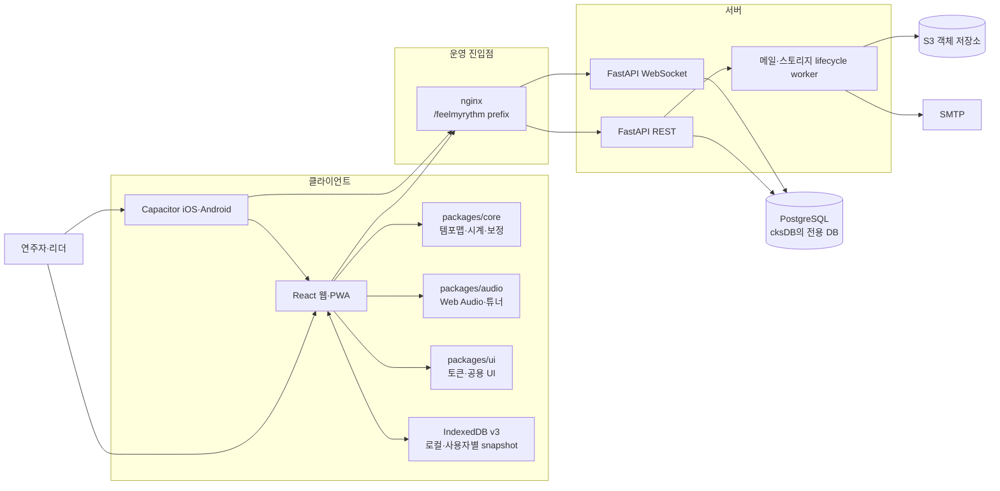

## 3. 기술 스택

| 영역 | 기술 | 기준 위치 | 역할 |
|---|---|---|---|
| 모노레포 | pnpm workspace 10.15, Node.js 22+, TypeScript strict | [`package.json`](../package.json), [`pnpm-workspace.yaml`](../pnpm-workspace.yaml) | 웹·모바일·공용 패키지의 빌드와 검증 |
| 웹 | React 19, React Router 7 data router, Vite 8, Tailwind CSS 4 | [`apps/web`](../apps/web) | 화면, 라우팅, PWA, 오프라인 조합 |
| 공용 UI | Radix Dialog/Toast, lucide-react, CSS 토큰 | [`packages/ui`](../packages/ui/src/index.ts) | 접근 가능한 공용 primitive와 박 시각화 |
| 도메인 코어 | 순수 TypeScript | [`packages/core`](../packages/core/src/index.ts) | 템포맵 검증·전개, locate/seek, 시계·보정 수학 |
| 오디오 | Web Audio API, Worker lookahead, AudioWorklet, YIN | [`packages/audio`](../packages/audio/src/index.ts) | 클릭 예약, transport, 출력 지연 매핑, 튜너 |
| API 타입 | OpenAPI → openapi-typescript | [`apps/server/openapi.json`](../apps/server/openapi.json), [`packages/protocol`](../packages/protocol/src/openapi.ts) | 서버 계약을 웹 TypeScript에서 재사용 |
| 서버 | Python 3.13, FastAPI, Pydantic, SQLAlchemy 2, Alembic | [`apps/server`](../apps/server/app/main.py) | 인증, 그룹·악보·연습 데이터, WS 방, worker |
| 데이터 | PostgreSQL 운영, SQLite 로컬·테스트 | [`db.py`](../apps/server/app/db.py), [`models.py`](../apps/server/app/models.py) | 영속 데이터와 revision·outbox |
| 객체 저장 | S3 운영, local adapter 개발 | [`storage.py`](../apps/server/app/storage.py) | 악보 staging/final 객체 |
| 모바일 | Capacitor 8, Swift, Kotlin | [`apps/mobile`](../apps/mobile/README.md) | 웹 번들 래핑, Keychain/Keystore, 딥링크, 햅틱 |
| 엣지·배포 | nginx, Docker/Compose, GHCR ARM64, GitHub Actions | [`nginx.conf`](../nginx/nginx.conf), [`deploy.yml`](../.github/workflows/deploy.yml) | `/feelmyrythm` 라우팅, 이미지 검증·배포 |
| 검증 | Vitest, Testing Library, Playwright, pytest, Ruff, mypy | [`vitest.workspace.ts`](../vitest.workspace.ts), [`playwright.config.ts`](../playwright.config.ts) | 단위·계약·반응형·실브라우저·서버 검증 |

## 4. 실제 시작점과 부팅 순서

### 4.1 프론트엔드 시작점

이 저장소에는 `index.tsx`가 없다. 실제 시작 순서는 다음과 같다.

```text
apps/web/index.html
  → apps/web/src/main.tsx
    → apps/web/src/App.tsx
      → apps/web/src/components/AppShell.tsx
        → apps/web/src/pages/*.tsx
```

| 단계 | 파일·심볼 | 실제 책임 |
| ---: | --- | --- |
| 1 | [`index.html`](../apps/web/index.html) | Vite HTML entry. `#root`를 만들고 `/src/main.tsx` ES module을 불러온다. React route나 상태는 여기 없다. |
| 2 | [`main.tsx`의 `bootstrap`](../apps/web/src/main.tsx) | 저장 테마 적용 → React root 생성 → 보안 대기 화면 → 안전한 PWA 전환 확인 → `App` 동적 import 순서로 실행한다. PWA 인증 cache 안전성을 증명하지 못하면 실제 앱을 mount하지 않는다. |
| 3 | [`App.tsx`의 `createAppRouter`](../apps/web/src/App.tsx) | `AuthProvider`, toast, native deep-link lifecycle, lazy page와 전체 route를 조립하는 composition root다. DOM mount entry는 아니다. |
| 4 | [`AppShell.tsx`의 `AppShell`](../apps/web/src/components/AppShell.tsx) | 모든 화면에 남는 topbar, desktop sidebar, mobile bottom navigation, legal link, route별 focus·scroll 복원과 `<Outlet>`을 제공한다. |
| 5 | [`pages`](../apps/web/src/pages) | route 단위 UI와 화면 state를 소유한다. 인증·로컬·원격 모드 전환도 중앙 guard가 아니라 각 화면에서 처리한다. |

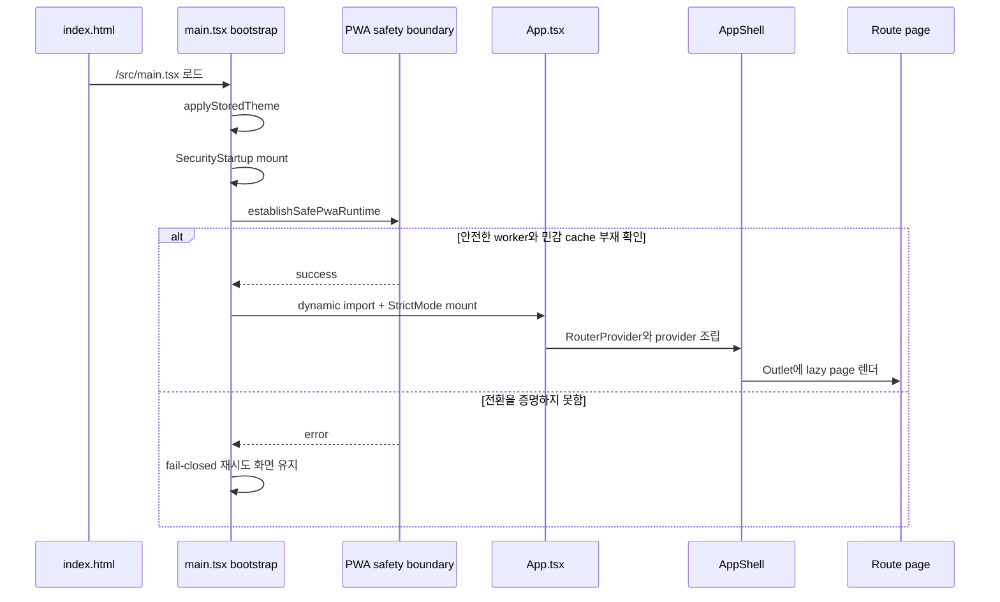

`AuthProvider`는 route를 보이기 전에 플랫폼 인증 저장소에서 atomic session envelope를 복구한다. 구형 envelope에 현재 `UserOut` 필드가 없으면 `/api/users/me`로 갱신하거나 전체 세션을 비운다. 브라우저와 네이티브의 저장 방식은 [11장](#11-인증오프라인캐시-경계)에서 설명한다.

### 4.2 백엔드 시작점

Spring Boot의 `MainApplication.java`에 해당하는 공개 ASGI 시작점은 [`apps/server/app/main.py`](../apps/server/app/main.py)의 `app = create_app()`이다.

| 단계 | 파일·심볼 | 실제 책임 |
| ---: | --- | --- |
| 1 | [`config.py`의 `load_settings`](../apps/server/app/config.py) | `FMR_` 환경변수와 `.env`를 Pydantic `Settings`로 파싱하고 운영 환경을 fail-fast 검증한다. |
| 2 | [`main.py`의 `create_app`](../apps/server/app/main.py) | FastAPI 객체, CORS, REST/WS router, health endpoint와 OpenAPI의 WS schema를 등록한다. |
| 3 | `create_app` 내부 `lifespan` | 실제 server startup에서 DB, mail queue, storage adapter·lifecycle worker, password/Google verifier, `RoomManager`를 만들고 `app.state`에 주입한다. |
| 4 | [`routers`](../apps/server/app/routers)와 [`ws.py`](../apps/server/app/ws.py) | HTTP·WebSocket 요청을 wire schema → 권한 → transaction/domain 처리로 연결한다. |
| 5 | lifespan shutdown | RoomManager → storage worker → mail queue drain → DB dispose 순서로 정리한다. |

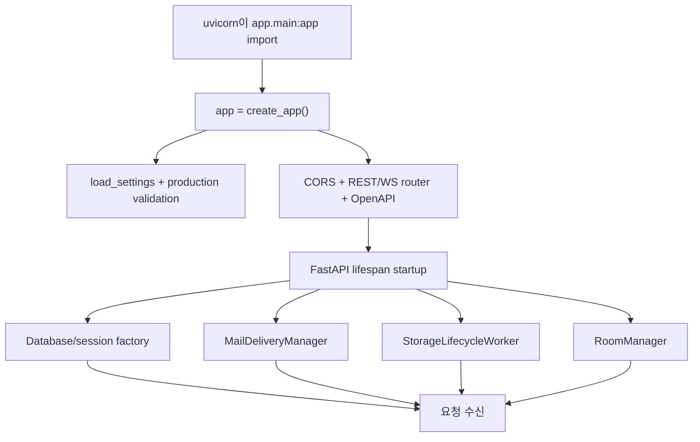

실행 방식은 환경에 따라 다르다.

- 로컬 checkout: `PORTFOLIO_AUTH_MODE=local scripts/portfolio-auth-mode.sh exec -- uv run --project apps/server uvicorn app.main:app --app-dir apps/server --reload`
- development image: [`Dockerfile`](../apps/server/Dockerfile)의 `development` target이 reload Uvicorn을 실행한다.
- production image: 같은 Dockerfile의 final target이 `/etc/portfolio-auth-build`의 immutable build branch/mode와 runtime canonical 계약을 공통 resolver와 server `Settings`에서 각각 대조하고, `load_settings()` 검증 뒤 `alembic upgrade head`와 `exec uvicorn app.main:app`을 순서대로 실행한다. 설정 또는 migration이 실패하면 API를 시작하지 않는다.

`create_app()` 호출만으로 DB 연결과 worker loop가 시작되는 것은 아니다. 이들은 ASGI lifespan startup 때 만들어진다. 따라서 app factory를 쓰는 테스트는 lifespan을 실제로 열었는지 구분해야 한다.

## 5. 메뉴·라우트와 기능별 코드 흐름

### 5.1 전체 route와 메뉴

route의 단일 선언 위치는 [`App.tsx`](../apps/web/src/App.tsx), 실제 메뉴 선언은 [`AppShell.tsx`](../apps/web/src/components/AppShell.tsx)다.

| 사용자 메뉴·경로 | React 시작 컴포넌트 | desktop | mobile | 인증 경계 |
| --- | --- | --- | --- | --- |
| 메트로놈 `/` | [`MetronomePage`](../apps/web/src/pages/MetronomePage.tsx) | sidebar | 하단 기본 | 로컬 사용 가능 |
| 템포맵 `/editor/:tempoMapId?` | [`EditorPage`](../apps/web/src/pages/EditorPage.tsx) | sidebar | 더보기 | 로컬 사용 가능, 원격 저장은 로그인 |
| 앙상블 `/session/:roomId?` | [`SessionPage`](../apps/web/src/pages/SessionPage.tsx) | sidebar | 하단 기본 | 로그인·멤버십 필요 |
| 악보 `/scores/:scoreId?` | [`ScoresPage`](../apps/web/src/pages/ScoresPage.tsx) | sidebar | 하단 기본 | 로컬 사용 가능 |
| 레퍼토리 악보 `/repertoire/:repertoireItemId/scores/:scoreId?` | `ScoresPage` | 악보 active | 하단 기본 | 해당 레퍼토리 멤버십 |
| 연습 `/practice/:repertoireItemId?` | [`PracticeRoute`](../apps/web/src/App.tsx) → [`PracticePage`](../apps/web/src/pages/PracticePage.tsx) | sidebar | 하단 기본 | 로컬 사용 가능. 로그인 상태에서 id 없는 `/practice`는 프로젝트 선택을 위해 `/dashboard`로 이동 |
| 튜너 `/tuner` | [`TunerPage`](../apps/web/src/pages/TunerPage.tsx) | sidebar | 더보기 | 로그인 불필요, 마이크 권한 필요 |
| 출력 보정 `/calibration` | [`CalibrationPage`](../apps/web/src/pages/CalibrationPage.tsx) | top-level 메뉴 없음 | 더보기 | 로컬 저장 가능, 서버 동기화는 로그인 |
| 프로젝트 `/dashboard` | [`DashboardPage`](../apps/web/src/pages/DashboardPage.tsx) | sidebar | 더보기 | 공유 workspace는 로그인 필요 |
| 설정 `/settings` | [`SettingsPage`](../apps/web/src/pages/SettingsPage.tsx) | topbar | 더보기 | 기기 설정은 로컬, 계정 작업은 로그인 |
| 로그인 `/login` | [`LoginPage`](../apps/web/src/pages/LoginPage.tsx) | topbar 계정 | 더보기 계정 | 공개 |
| 개인정보 `/privacy` | [`PrivacyPage`](../apps/web/src/pages/PrivacyPage.tsx) | legal | 더보기 legal | 공개 |
| 계정 삭제 `/delete-account` | [`AccountDeletionPage`](../apps/web/src/pages/AccountDeletionPage.tsx) | legal | 더보기 legal | 안내는 공개, 완료는 재인증 필요 |

별도의 전역 `ProtectedRoute`는 없다. Session은 비로그인 gate를 직접 표시하고, Dashboard는 로그인/로컬 상태를 나누며, Metronome·Editor·Scores·Practice는 route와 인증 문맥에 따라 로컬 또는 원격 모드를 고른다. 기능을 추가할 때 이 페이지별 경계를 무시하고 router에서 일괄 redirect하면 비로그인 로컬 기능을 깨뜨릴 수 있다.

### 5.2 화면에서 데이터까지 가는 공통 구조

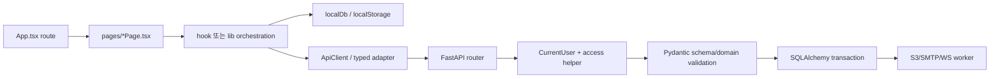

화면에서 `fetch`와 JSON cast를 직접 흩뿌리는 대신 공통 [`ApiClient`](../apps/web/src/lib/api.ts) 또는 `scoreApi` 같은 기능 adapter를 통과시키는 이유는 refresh, camelCase wire format, 오류 분류, revision과 cache 경계를 한곳에서 유지하기 위해서다.

### 5.3 기능별 상세 연결표

| 기능 | 화면·orchestration | client/core 흐름 | 서버·영속 흐름 |
| --- | --- | --- | --- |
| 메트로놈 | `MetronomePage`가 route의 `repertoire`·`measure`와 로컬 설정을 읽고 [`useMetronome`](../apps/web/src/lib/useMetronome.ts)에 `TempoMap`을 준다. | `validateTempoMap` → `expandTimeline` → `TimelineTransport` → `LookaheadScheduler` → `WebAudioEngine`; rAF는 예약 beat queue를 읽는다. 원격 network failure만 [`localDb`](../apps/web/src/lib/localDb.ts)의 user-scoped snapshot으로 대체한다. | 원격 map은 `GET /api/repertoire/{id}/tempomap` → [`repertoire.py`](../apps/server/app/routers/repertoire.py) → immutable `TempoMapRevision`. 서버는 beat를 보내지 않는다. |
| 템포맵 편집 | `EditorPage`가 로컬 ID 또는 repertoire ID로 authoritative source를 고르고 dirty/blocker·충돌 modal을 소유한다. | core validation과 실제 timeline 전개가 모두 성공해야 저장한다. 원격 저장은 `{expectedRevision,data}`, 409는 [`tempoMapMerge`](../apps/web/src/lib/tempoMapMerge.ts)로 최신본/초안 rebase를 선택한다. | `PUT /api/repertoire/{id}/tempomap` → leader 권한 → current row lock → expected revision 비교 → 새 `TempoMapRevision` insert. 기존 revision은 수정하지 않는다. |
| 앙상블 | `SessionPage`가 workspace, 방 REST, [`RoomClient`](../apps/web/src/lib/roomClient.ts), `useMetronome.startSynchronized`를 연결한다. | `JOIN_ROOM` 후 PING 표본으로 offset을 추정하고 `TRANSPORT(serverStartTimeNs, revision, anchor)`를 server→performance→audio time으로 변환한다. | `POST /api/rooms`가 revision·anchor 집합을 고정한다. [`ws.py`](../apps/server/app/ws.py)는 first-frame bearer와 membership을 검증하고 [`RoomManager`](../apps/server/app/rooms.py)가 READY/START/STOP/SEEK와 roster를 관리한다. |
| 악보 목록·업로드 | `ScoresPage` → [`scoreApi`](../apps/web/src/lib/scoreApi.ts). PDF.js, image element, OSMD renderer를 형식별로 lazy 사용한다. | presign → 인증 header 없는 staging upload → complete 순서다. 목록·본문·MeasureMap·annotation snapshot은 user ID로 분리한다. | [`scores.py`](../apps/server/app/routers/scores.py)가 pending `Score`를 만들고 complete에서 staging을 final key로 promote한 뒤 ready와 staging deletion outbox를 commit한다. |
| 마디 매핑·필기 | `ScoresPage`의 pointer/keyboard mapping과 annotation 도구가 정규화 page 좌표·canonical measure를 만든다. | `scoreApi.putMeasureMap`, create/update/delete annotation. metadata+MeasureMap은 하나의 settings 요청으로 보낸다. | `MeasureMap`·`Annotation`은 expected revision을 검사한다. repertoire 전체 annotation 조회는 마디 필기를 다른 파트 map에 재투영하는 데 쓰인다. |
| MusicXML | 업로드 뒤 `ScoresPage`가 초안의 구간·jump·경고를 보여 주고 명시적 저장을 기다린다. | 로컬 경로는 [`musicxml.ts`](../apps/web/src/lib/musicxml.ts), 원격은 multipart draft API를 쓴다. | `POST /api/repertoire/{id}/musicxml/draft` → [`musicxml.py`](../apps/server/app/musicxml.py)의 defused parser·MXL 제한 → 저장 전 `TempoMapData` 검증. |
| 연습일지·할일 | `PracticePage`가 Markdown, 마디 anchor, todo 담당자·기한을 조합한다. | [`practiceApi`](../apps/web/src/lib/practiceApi.ts)와 `ApiClient`; 비로그인은 로컬 저장, 원격은 성공 응답을 IndexedDB snapshot으로 교체한다. | [`repertoire.py`](../apps/server/app/routers/repertoire.py)의 log/todo CRUD가 anchor score 소속, assignee membership과 작성자·role 권한을 검사한다. |
| 튜너 | `TunerPage`가 [`TunerEngine`](../packages/audio/src/tuner.ts)의 start/stop·reading 구독을 관리한다. | `getUserMedia` → AudioWorklet frame → YIN → median stabilizer → note/cents. A4 preset만 기기에 저장한다. | 서버 API가 없는 local-only 기능이다. |
| 출력 보정 | `CalibrationPage`가 출력 장치·Bluetooth 상태를 읽고 9개 click/tap 표본을 모은다. | 첫 표본 제외 median offset → [`localDb`](../apps/web/src/lib/localDb.ts)에 기기별 저장 → 로그인 시 API upsert. | `/api/calibrations` → [`calibrations.py`](../apps/server/app/routers/calibrations.py) → `DeviceCalibration`. Session JOIN에 calibration ID·Bluetooth 상태를 포함한다. |
| 프로젝트 | `DashboardPage` → [`loadWorkspace`](../apps/web/src/lib/workspace.ts). root groups만 권위 요청이고 하위 members/projects/repertoire는 최대 6개 병렬 `allSettled`로 부분 성공을 보존한다. | `ApiClient`로 group/project/repertoire/member CRUD. 불완전한 branch의 관리 조작은 잠그고 retry한다. | [`groups.py`](../apps/server/app/routers/groups.py), `repertoire.py`와 [`access.py`](../apps/server/app/access.py)가 owner/leader/member 계층을 검사한다. |
| 설정·계정 | `SettingsPage`가 theme, count-in, volume, visual offset, storage estimate와 삭제 modal을 소유한다. | [`theme.ts`](../apps/web/src/lib/theme.ts), `localDb.storageEstimate`, `AuthProvider.logout/deleteAccount`, memory-only deletion challenge. | `/api/users/me`, `/api/users/me/delete-challenge`, `DELETE /api/users/me` → [`auth.py`](../apps/server/app/routers/auth.py). 계정 tombstone과 storage deletion outbox를 같은 transaction에 기록한다. |
| 로그인·가입 | `LoginPage` → [`AuthProvider`](../apps/web/src/lib/auth.tsx) → `ApiClient`. fragment credential은 layout effect에서 URL에서 즉시 제거하고 component memory에서만 사용한다. | 가입 1단계에는 password가 없고, 메일 link에서 최초 password를 정한다. login/refresh/logout session envelope는 플랫폼 저장소가 담당한다. | [`auth.py`](../apps/server/app/routers/auth.py) → [`security.py`](../apps/server/app/security.py) → `User`·`RefreshSession`; 자세한 상태 전이는 다음 장에 있다. |

## 6. 인증·보안·배치·설정 전반

### 6.1 회원가입·로그인·비밀번호 상태 전이

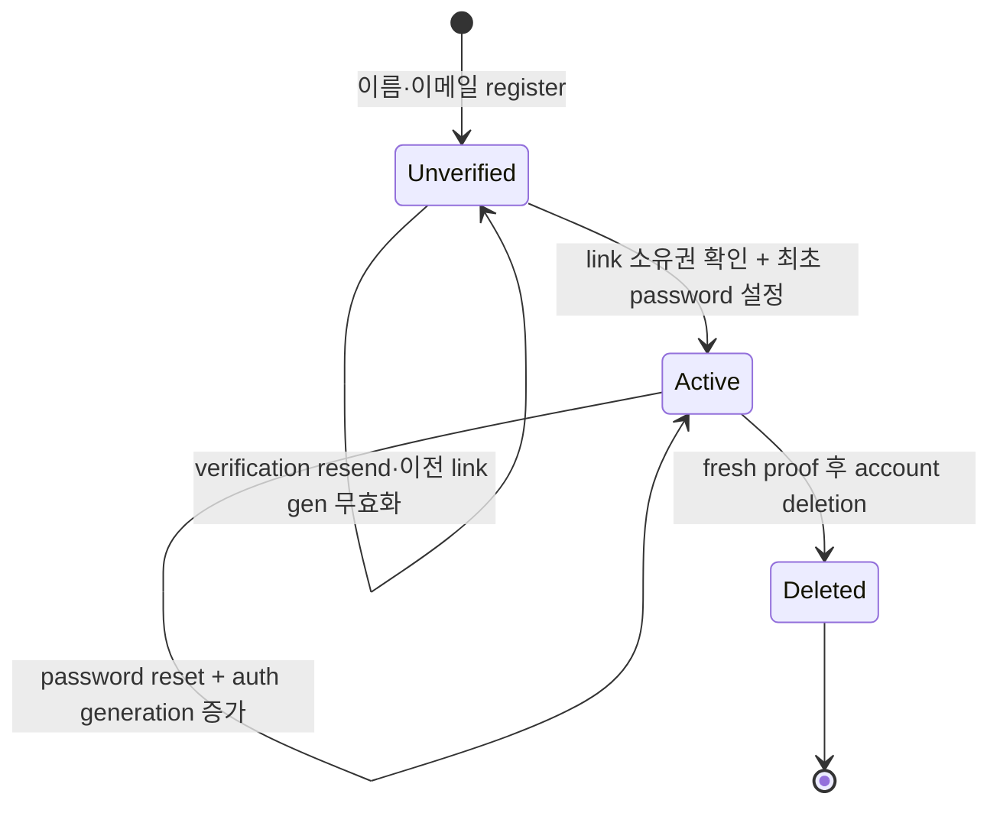

가입 시 공격자가 먼저 넣은 password를 이메일 소유자가 물려받지 않도록 `RegisterIn`은 이름과 이메일만 받는다. 서버는 미검증 `User(password_hash=None)`를 만들고 메일 link의 `sub/email/gen/exp`를 확인한 뒤에만 새 password hash와 인증 session을 만든다.

| 사용자 흐름 | web 호출 | server endpoint·핵심 처리 |
| --- | --- | --- |
| 회원가입 시작 | `AuthProvider.register` | `POST /api/auth/register`: email casefold, generic 응답, verification attempt를 먼저 commit하고 bounded mail queue에 enqueue |
| 가입 완료 | `AuthProvider.verifyEmail` | `POST /api/auth/verify-email`: link의 identity/generation/expiry + password 8–128자/확인 일치, bcrypt hash, verified, token pair |
| 인증 메일 재전송 | `resendVerification` | `POST /api/auth/resend-verification`: cooldown과 새 generation으로 이전 link 무효화 |
| 이메일 로그인 | `login` | `POST /api/auth/login`: active·verified·password 계정, dummy hash를 포함한 일정한 검증 경로 |
| Google 로그인 | `loginWithGoogle` | `POST /api/auth/google`: Google audience·subject·verified email 검사, preclaim password 제거, 충돌 409 |
| Portfolio SSO | `AuthProvider` 초기 exchange | `POST /api/auth/sso`: edge secret 검증, immutable subject 우선 조회, unique email legacy link 또는 managed-local verified user provision, 충돌 409 |
| access 갱신 | `ApiClient.refresh` | `POST /api/auth/refresh`: refresh row lock/revoke/rotate. 권위 있는 401만 client session 삭제 |
| 로그아웃 | `logout` | `POST /api/auth/logout` best effort 후 client session 즉시 제거 |
| reset 요청 | `requestPasswordReset` | `POST /api/auth/request-password-reset`: 계정 존재를 숨기는 동일 응답과 cooldown |
| reset 완료 | `resetPassword` | `POST /api/auth/reset-password`: one-use generation link, 새 hash, 모든 refresh revoke |
| 탈퇴 proof | Settings/Google 또는 email challenge | `POST /api/users/me/delete-challenge`: 짧은 fresh proof link. URL 제거 뒤 web memory에만 둔다. |
| 계정 삭제 | `deleteAccount` | `DELETE /api/users/me`: proof·email·필요 시 current password 검증, 계정·소유 계층 정리와 outbox transaction |

### 6.2 password·JWT·session 보안

| 경계 | 구현과 설정 |
| --- | --- |
| password hash | UTF-8 password를 SHA-256 prehash한 뒤 bcrypt를 사용한다. 검증 동시성은 `FMR_PASSWORD_VERIFY_CONCURRENCY` 기본 4로 제한하고 포화 시 429/`Retry-After`를 반환한다. 없는 계정도 dummy bcrypt를 수행한다. |
| JWT | HS256, issuer, `sub`, `typ`, `jti`, `iat`, `exp`, `auth_generation`을 검사한다. access 기본 15분, refresh 기본 30일이다. |
| refresh 저장 | raw refresh token은 client에만 있고 DB에는 JTI의 SHA-256 hash만 둔다. 회전 때 row lock으로 기존 record를 revoke한다. |
| refresh race | `ApiClient`는 동일 session generation의 refresh를 single-flight로 공유하고 늦은 옛 session 응답이 새 로그인을 덮지 못하게 한다. network/5xx는 기존 token을 지우지 않는다. |
| 웹 저장 | access·refresh·user를 `fmr.auth.session.v1` 하나로 localStorage에 저장한다. HttpOnly cookie 모델이 아니므로 XSS 방어와 CSP가 중요하다. |
| 네이티브 저장 | 플랫폼 adapter가 iOS Keychain의 ThisDeviceOnly 계열과 Android Keystore AES-GCM을 사용한다. Android cloud·device-transfer backup은 차단한다. |
| REST 인증 | `Authorization: Bearer` → [`dependencies.py`](../apps/server/app/dependencies.py)의 `CurrentUser` → active·verified·현재 generation 확인. SSO mode에서는 앱별 edge secret과 현재 `Remote-User == User.sso_subject`도 모든 bearer HTTP 요청에서 검사한다. |
| WS 인증 | query/cookie가 아니라 첫 `JOIN_ROOM`/`JOIN_ANNOTATIONS` frame의 access token을 검증하고 membership을 확인한다. SSO mode에서는 같은 handshake의 trusted edge secret과 `Remote-User == User.sso_subject`도 요구하며, transport 명령마다 현재 role을 다시 읽는다. |
| 역할 | `member < leader < owner`. owner는 그룹·멤버, leader 이상은 프로젝트·레퍼토리·템포맵·악보·방 transport를 관리한다. annotation은 작성자 또는 leader 이상의 별도 규칙을 적용한다. |

앱 내부에는 IP 기반 rate limiter, CAPTCHA, trusted proxy IP parser가 없다. email별 cooldown과 bcrypt semaphore는 애플리케이션 보호층이고, 대규모 abuse 제한은 신뢰 가능한 nginx/CDN·메일 provider에서 별도로 구성해야 한다.

### 6.3 CORS·HTTP·PWA 보안 설정

| 위치 | 적용 내용 | 주의점 |
| --- | --- | --- |
| [`main.py`](../apps/server/app/main.py) CORS | 설정된 origin, credentials, GET/POST/PUT/PATCH/DELETE/OPTIONS, Authorization/Content-Type만 허용 | WebSocket에는 CORSMiddleware가 적용되지 않는다. WS의 실질 경계는 first-frame bearer+membership이며 SSO mode에서는 edge subject+secret까지 포함한다. |
| [`nginx.conf`](../nginx/nginx.conf) | `nosniff`, frame deny, base/object/frame CSP, strict referrer, HSTS, API `no-store`, index no-cache, hash asset immutable | direct Uvicorn/Vite 개발 경로에는 같은 nginx header가 없다. 현재 CSP는 완전한 `script-src` allowlist가 아니다. |
| [`vite.config.ts`](../apps/web/vite.config.ts) PWA | `/api`를 navigation/runtime cache에서 제외하고 공개 image/font와 renderer만 cache | 인증 API를 Workbox Cache Storage에 넣지 않는다. |
| [`pwaCache.ts`](../apps/web/src/lib/pwaCache.ts) | 구형 `fmr-api` cache 삭제 → 안전 generation worker 제어권 → legacy worker 종료 → 재삭제 | 어느 단계든 증명할 수 없으면 `main.tsx`가 앱 mount를 거부한다. |

### 6.4 배치와 스케줄러: 무엇이 실제로 존재하는가

Celery, RQ, APScheduler, Kubernetes CronJob이나 OS cron은 없다. API process lifespan에 다음 세 worker가 붙는다.

| 구성요소 | 종류 | trigger·주기 | 내구성·다중 process 의미 |
| --- | --- | --- | --- |
| [`MailDeliveryManager`](../apps/server/app/mailer.py) | 이벤트성 bounded thread queue. 정기 batch가 아님 | 가입·reset·탈퇴 요청이 enqueue. worker 기본 2, queue 128, shutdown drain 5초 | memory queue라 process 재시작 후 복구·자동 retry가 없다. cooldown attempt는 enqueue 전에 DB commit한다. |
| [`StorageLifecycleWorker`](../apps/server/app/storage_lifecycle.py) | 주기 worker + 제한 batch | 기본 30초마다 stale pending reap, local temp cleanup, due deletion 최대 100개 claim | `StorageDeletionJob`, `FOR UPDATE SKIP LOCKED`, lease 300초, 5초→최대 3600초 backoff로 내구·다중 worker 안전 |
| [`RoomManager`](../apps/server/app/rooms.py) cleanup | 주기 in-process housekeeping | 기본 30초마다 빈 방·TTL 기본 1800초 확인 | room registry는 process memory다. 현재 realtime 방 상태는 단일 server process 전제이며 storage outbox처럼 replica 간 공유되지 않는다. |

클라이언트의 audio lookahead Worker는 기본 25ms tick·120ms 선예약을 수행하지만 server batch가 아니다. `requestAnimationFrame`은 시각화 loop이고, WS `while True`는 연결별 receive loop다. GitHub Actions도 push/PR/manual/Validate 완료 event 기반이며 cron schedule은 없다.

### 6.5 설정 원본과 환경변수

서버 설정의 단일 원본은 [`Settings`](../apps/server/app/config.py)다. 환경변수 prefix는 `FMR_`, 기본 env file은 process CWD의 `.env`다.

| 설정군 | 주요 변수 | 기본·검증 의미 |
| --- | --- | --- |
| 환경·DB | `FMR_ENVIRONMENT`, `FMR_DATABASE_URL`, `FMR_AUTO_CREATE_SCHEMA` | 개발 기본 SQLite/auto-create. 운영은 PostgreSQL과 `false`를 강제하고 Alembic만 사용 |
| Portfolio auth | `PORTFOLIO_BRANCH`, `PORTFOLIO_AUTH_MODE`, `FMR_DEPLOYMENT_PROFILE`, legacy `FMR_SSO_ENABLED`, `FMR_SSO_EDGE_SECRET_FILE` (`FMR_SSO_EDGE_SECRET` fallback) | 공통 resolver는 `main/dev → sso`, 나머지 branch → `local`을 강제한다. local checkout은 Git branch를 감지하고 CI/build/container는 branch와 mode를 명시한다. legacy SSO flag가 있으면 canonical mode와 정확히 일치해야 한다. SSO는 32–4096 printable byte 앱 전용 edge secret을 강제한다. `managed_local_sso`는 절대 local upload path와 SMTP 금지를 추가하며 rootless host는 `cks:cks` mode-0640 file을 read-only bind하고 Compose는 UID 10001/GID 0을 사용한다. 서버는 container `root:root` mode 0640과 effective GID 0을 검증한다. |
| JWT | `FMR_JWT_SECRET`, `FMR_JWT_ISSUER`, `FMR_ACCESS_TOKEN_MINUTES`, `FMR_REFRESH_TOKEN_DAYS` | 운영 secret 32자 이상·알려진 placeholder 거부. 개발에서 생략하면 process-random이라 재시작 시 기존 token 만료 |
| Google | `FMR_GOOGLE_CLIENT_ID` | server ID-token audience. web build의 `VITE_GOOGLE_CLIENT_ID`와 같은 OAuth web client ID 사용 |
| link | `FMR_WEB_APP_BASE_URL`, verification/reset/delete 만료·재요청 초 | 운영 HTTPS·query/fragment 없음. 기본 link 만료 verification/reset 30분, delete 15분 |
| SMTP | host/port/from, username/password, STARTTLS/SSL | 운영 host+from 필수, 인증 값은 쌍, STARTTLS/SSL 정확히 하나. 기본 587 STARTTLS |
| auth worker | mail worker count/capacity/shutdown, password verify concurrency | 기본 `2/128/5초/4` |
| network | `FMR_CORS_ORIGINS`, `FMR_PUBLIC_API_BASE_URL` | CORS는 JSON array. 운영 public API는 HTTPS absolute URL |
| storage | backend, local dir, max bytes, upload TTL, S3 bucket/region/endpoint | 운영은 S3, bucket·region 필수. boto3 자격증명은 표준 AWS provider chain 사용 |
| storage worker | enabled, interval, batch, lease, retry, pending grace, late guard, temp TTL | 운영 worker는 끌 수 없다. retry base≤max, redelete interval≤late guard 검증 |
| room | lead time, TTL, cleanup interval | 기본 `3000ms/1800초/30초` |

추가 설정 원본:

- Vite: [`vite.config.ts`](../apps/web/vite.config.ts). 웹 base `/feelmyrythm/`, mobile base `./`, dev API/WS proxy, PWA와 `VITE_GOOGLE_CLIENT_ID`를 담당한다.
- UI theme: [`tokens.css`](../packages/ui/src/tokens.css), [`theme.ts`](../apps/web/src/lib/theme.ts).
- 모바일: [`capacitor.config.ts`](../apps/mobile/capacitor.config.ts), iOS/Android manifest와 signing script.
- DB migration: [`alembic/env.py`](../apps/server/alembic/env.py)가 같은 `FMR_DATABASE_URL`을 사용한다.
- production runtime: [`docker-compose.prod.yml`](../docker-compose.prod.yml); secret 실제 값은 untracked `.env`와 provider credential store에 둔다.

## 7. 모노레포 지도

```text
FeelMyRythm/
├── AGENTS.md                     # 가장 높은 프로젝트 규칙과 구현 계약
├── docs/                         # 설계, UI, 반응형, 기능·회고·코드 가이드
├── packages/
│   ├── core/                     # 플랫폼 비의존 도메인 수학
│   ├── audio/                    # Web Audio·transport·tuner
│   ├── ui/                       # 토큰·primitive·BeatVisualizer
│   └── protocol/                 # OpenAPI 생성 TypeScript 타입
├── apps/
│   ├── web/                      # React 앱, IndexedDB, PWA
│   ├── mobile/                   # Capacitor, iOS/Android 프로젝트
│   └── server/                   # FastAPI, SQLAlchemy, Alembic, worker
├── e2e/                          # 사용자 흐름·반응형·PWA Playwright
├── scripts/audio_quality/        # 녹음 기반 drift·device offset 분석
├── nginx/nginx.conf              # 공개 prefix, SPA, API/WS proxy
├── docker-compose*.yml           # 개발·운영 컨테이너 토폴로지
└── .github/                      # CI, ARM64 이미지 smoke, 제한 배포
```

### 패키지 의존 방향

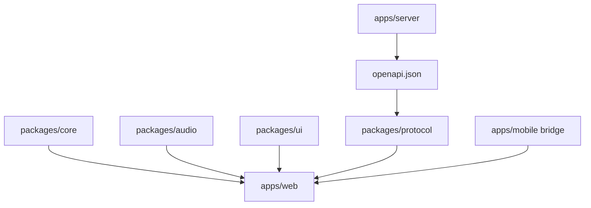

`packages/core`에는 DOM, React, Web Audio, 네트워크 코드를 넣지 않는다. `packages/audio`도 서버 상태를 직접 알지 않고 이미 전개된 타임라인과 시간 매핑만 받는다.

## 8. 웹과 모바일의 실행 경로

### 브라우저 운영 경로

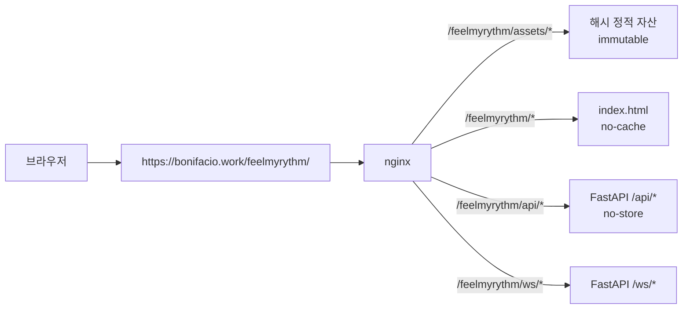

- 브라우저 Vite `base`와 Router `basename`은 `/feelmyrythm/`이다: [`vite.config.ts`](../apps/web/vite.config.ts), [`paths.ts`](../apps/web/src/lib/paths.ts).
- [`main.tsx`](../apps/web/src/main.tsx)는 테마를 먼저 적용하고, 구형 Service Worker의 인증 API cache를 안전하게 제거한 뒤에만 앱을 마운트한다.
- [`App.tsx`](../apps/web/src/App.tsx)는 provider와 모든 화면 route의 출발점이다.

### Capacitor 경로

- `vite build --mode mobile`은 상대 경로 `./`를 사용해 [`apps/mobile/web`](../apps/mobile)로 출력한다.
- 네이티브 번들은 로컬 HTML을 열지만 REST/WS는 `https://bonifacio.work/feelmyrythm/api|ws`로 보낸다.
- [`nativeAudio.ts`](../apps/mobile/src/nativeAudio.ts)가 Web Audio와 네이티브 오디오 clock 사이의 batch scheduling 경계를 제공하고, [`nativeBridge.ts`](../apps/mobile/src/nativeBridge.ts)가 keep-awake, haptics, system bar와 딥링크를 추상화한다.
- [`secureStorage.ts`](../apps/mobile/src/secureStorage.ts)는 브라우저 localStorage와 iOS Keychain/Android Keystore 경계를 분리한다.
- 웹 번들 변경 뒤에는 `corepack pnpm --filter @feelmyrythm/mobile sync`로 세 복사본과 동적 chunk까지 검증한다.

## 9. 핵심 도메인과 데이터 흐름

### 템포맵

[`types.ts`](../packages/core/src/types.ts)의 `TempoMap`이 중심 타입이다.

```text
TempoMap
├── totalMeasures, anacrusis, countIn
├── sections[]
│   ├── measure 범위, meter, BPM, beat unit
│   ├── accent/subdivision
│   └── rit./accel. target
└── jumps[]
    ├── repeat + volta endings
    ├── D.C. / D.S.
    └── Fine / Coda 이동
```

변환 흐름은 다음과 같다.

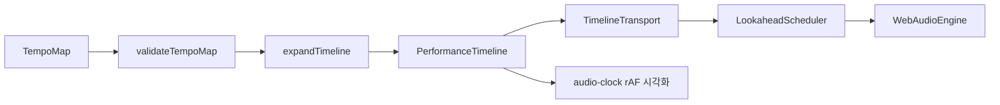

- 구조와 의미 검증: [`validation.ts`](../packages/core/src/validation.ts)
- 반복·볼타·D.C./D.S./Coda 전개: [`timeline.ts`](../packages/core/src/timeline.ts)
- 편집 화면: [`EditorPage.tsx`](../apps/web/src/pages/EditorPage.tsx)
- 웹 통합 transport: [`useMetronome.ts`](../apps/web/src/lib/useMetronome.ts)

### 결정론적 앙상블 동기화

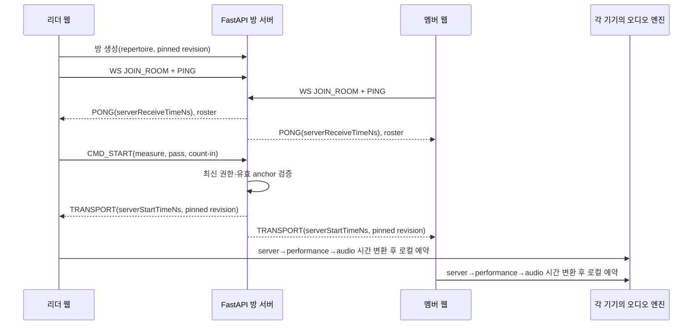

중요한 코드:

- 순수 시계 추정: [`clock-sync.ts`](../packages/core/src/clock-sync.ts)
- server/performance/audio 매핑: [`clockMapping.ts`](../packages/audio/src/clockMapping.ts)
- WS 클라이언트와 재연결 정책: [`roomClient.ts`](../apps/web/src/lib/roomClient.ts)
- 서버 방·revision·anchor 고정: [`rooms.py`](../apps/server/app/rooms.py)
- WS envelope 처리: [`ws.py`](../apps/server/app/ws.py)

서버는 클릭 event를 스트리밍하지 않는다. 이 원칙을 깨면 네트워크 jitter가 곧 오디오 jitter가 된다.

## 10. 서버 도메인과 영속 데이터

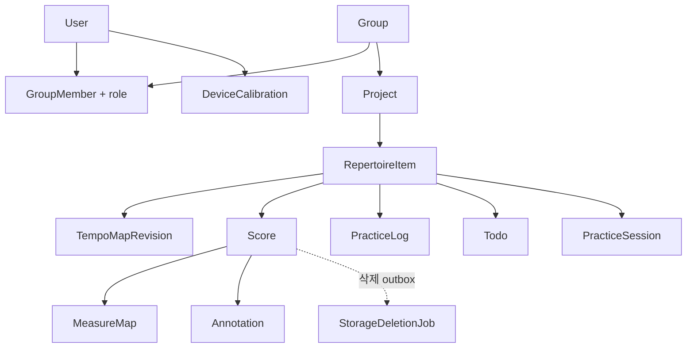

모델의 실제 선언은 [`models.py`](../apps/server/app/models.py), 입력·출력 검증은 [`schemas.py`](../apps/server/app/schemas.py)에서 본다. 주요 router는 다음과 같이 나뉜다.

| Router | 파일 | 책임 |
|---|---|---|
| 인증·사용자 | [`routers/auth.py`](../apps/server/app/routers/auth.py) | 이메일 completion/reset, Google, token rotation, 계정 삭제 |
| 그룹·프로젝트 | [`routers/groups.py`](../apps/server/app/routers/groups.py) | role 기반 CRUD와 멤버십 |
| 레퍼토리·템포맵·연습 | [`routers/repertoire.py`](../apps/server/app/routers/repertoire.py) | revision, access, log/todo |
| 악보 | [`routers/scores.py`](../apps/server/app/routers/scores.py) | 업로드, metadata/map, annotation, MusicXML |
| 방 | [`routers/rooms.py`](../apps/server/app/routers/rooms.py) | 방 생성·조회 |
| 캘리브레이션 | [`routers/calibrations.py`](../apps/server/app/routers/calibrations.py) | 기기·출력별 offset |

[`main.py`](../apps/server/app/main.py)의 lifespan이 DB, mail queue, storage lifecycle worker, RoomManager를 조립하고 종료 순서를 책임진다.

현재 Alembic chain은 [`alembic/versions`](../apps/server/alembic/versions)에서 확인한다.

```text
b881b6589baa  initial schema
  → 72d06f7d91c4  email verification + auth generation
    → b44b9e7c2d10  secure auth completion/reset/delete attempts
      → c7f2a9d4e6b1  staging upload + durable storage deletion outbox
        → e3a1f6c9b2d4  persistent OMR draft jobs (head)
```

[`alembic/env.py`](../apps/server/alembic/env.py)는 `Settings.database_url`로 Alembic URL을 덮어쓴다. 운영은 `AUTO_CREATE_SCHEMA=false`와 Alembic을 강제하고, 개발의 `create_all`은 fresh SQLite 편의를 위한 별도 경로다.

초기 운영판이 `Base.metadata.create_all()`로 만든 PostgreSQL DB에는 `alembic_version`이 없다. root revision은 이 상태에서 정확한 legacy table·column signature를 먼저 검사하고, 일치할 때만 기존 table을 `fmr_legacy` schema로 옮긴 뒤 새 revision schema를 만들고 사용자·그룹·곡·템포맵·악보 metadata·measure map·주석·연습 기록·할 일·calibration row를 같은 migration transaction에서 복사한다. 기존 `stored_name`은 S3 이관 시 같은 object key로 유지한다. 변환이 끝나면 임시 schema를 제거하며, signature가 다르면 임의 stamp나 부분 변환 없이 실패한다. 실제 PostgreSQL 회귀 테스트는 별도 임시 DB에서 이 upgrade와 row 보존을 검증한다.

## 11. 인증·오프라인·캐시 경계

### 인증

- 브라우저 인증 상태는 하나의 `fmr.auth.session.v1` envelope로 저장한다: [`auth.tsx`](../apps/web/src/lib/auth.tsx).
- managed-local browser SSO는 stable central subject로 앱 계정을 자동 연결·생성한다. access/refresh token만으로는 충분하지 않으며 동일 요청의 trusted edge secret과 현재 subject가 token 사용자에 묶여야 한다: [`sso.py`](../apps/server/app/sso.py).
- access token 401은 refresh를 single-flight로 회전한다. 세대가 바뀐 늦은 응답은 새 로그인 세션을 덮지 못한다: [`api.ts`](../apps/web/src/lib/api.ts).
- refresh endpoint의 확정 401만 세션을 제거한다. 네트워크 오류와 5xx는 기존 신원을 유지하고 재시도 가능한 오류로 전달한다.
- 네이티브 refresh token은 Keychain/Keystore에 두며 브라우저 저장소와 섞지 않는다.
- 이메일 링크의 계정 삭제 증명은 URL fragment를 즉시 제거한 뒤 런타임 메모리에만 둔다: [`accountDeletionChallenge.ts`](../apps/web/src/lib/accountDeletionChallenge.ts).

### IndexedDB v3

[`localDb.ts`](../apps/web/src/lib/localDb.ts)는 두 데이터 계층을 분리한다.

| 계층 | key | 쓰임 |
|---|---|---|
| 익명 로컬 데이터 | 로컬 entity ID | 로그인 없이 만든 템포맵·악보·필기·보정 |
| 원격 snapshot | `[userId, entityId]` 복합 key | 마지막으로 성공한 서버 응답의 사용자별 읽기 전용 fallback |

원격 fallback은 `TypeError` 계열 실제 network failure에서만 허용한다. 401/403/404/409/422/5xx를 캐시로 숨기지 않는다. v1/v2의 소유자 없는 원격 row는 안전하게 귀속할 수 없으므로 v3 migration에서 폐기한다.

### PWA

- 인증 API 응답은 Workbox Cache Storage에 저장하지 않는다: [`vite.config.ts`](../apps/web/vite.config.ts).
- 구형 `fmr-api` cache 삭제와 안전한 Service Worker 제어권 전환을 확인하기 전에는 앱을 마운트하지 않는다: [`pwaCache.ts`](../apps/web/src/lib/pwaCache.ts), [`main.tsx`](../apps/web/src/main.tsx).
- 렌더러·공개 이미지 같은 비인증 정적 자산만 별도 cache한다.

## 12. 악보 객체의 생명주기

악보 metadata와 객체 저장소는 한 트랜잭션으로 묶을 수 없기 때문에 staging과 durable outbox를 사용한다.

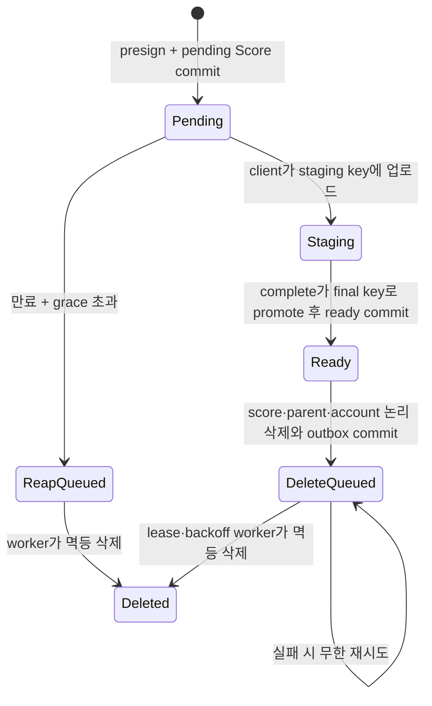

- 저장소 adapter: [`storage.py`](../apps/server/app/storage.py)
- outbox enqueue·stale pending reaper·lease worker: [`storage_lifecycle.py`](../apps/server/app/storage_lifecycle.py)
- 스키마 migration: [`c7f2a9d4e6b1_durable_storage_lifecycle.py`](../apps/server/alembic/versions/c7f2a9d4e6b1_durable_storage_lifecycle.py)

삭제 API의 `204`는 “DB의 논리 삭제와 물리 삭제 작업 등록이 원자적으로 끝났다”는 뜻이다. S3 삭제 완료를 동기적으로 뜻하지 않는다.

## 13. 처음 코드를 읽는 권장 순서

| 단계 | 읽을 파일 | 확인할 질문 |
|---:|---|---|
| 1 | [`AGENTS.md`](../AGENTS.md), [`README.md`](../README.md) | 절대 깨면 안 되는 운영·브랜치·동기화 규칙은 무엇인가? |
| 2 | [`DESIGN.md`](DESIGN.md), [`RESPONSIVE_UX.md`](RESPONSIVE_UX.md) | 제품의 도메인 모델과 화면 적응 계약은 무엇인가? |
| 3 | [`core/types.ts`](../packages/core/src/types.ts), [`validation.ts`](../packages/core/src/validation.ts) | 유효한 템포맵이란 무엇인가? |
| 4 | [`core/timeline.ts`](../packages/core/src/timeline.ts), [`clock-sync.ts`](../packages/core/src/clock-sync.ts) | 악보 순서와 서버 시간이 어떻게 결정론적으로 계산되는가? |
| 5 | [`audio/transport.ts`](../packages/audio/src/transport.ts), [`scheduler.ts`](../packages/audio/src/scheduler.ts), [`webAudioEngine.ts`](../packages/audio/src/webAudioEngine.ts) | 타임라인이 언제 실제 클릭으로 바뀌는가? |
| 6 | [`App.tsx`](../apps/web/src/App.tsx), [`AppShell.tsx`](../apps/web/src/components/AppShell.tsx) | provider, route, 포커스·내비게이션 경계는 어디인가? |
| 7 | [`useMetronome.ts`](../apps/web/src/lib/useMetronome.ts), [`roomClient.ts`](../apps/web/src/lib/roomClient.ts) | 로컬 재생과 동기 재생이 어디서 합쳐지는가? |
| 8 | 관심 화면의 [`pages`](../apps/web/src/pages)와 대응 [`lib`](../apps/web/src/lib) | 화면 state와 API/cache 책임이 잘 분리됐는가? |
| 9 | [`models.py`](../apps/server/app/models.py), [`schemas.py`](../apps/server/app/schemas.py), [`main.py`](../apps/server/app/main.py) | DB, wire schema, runtime 조립이 어떻게 연결되는가? |
| 10 | 관련 server router와 테스트 | 권한·revision·rollback·409 계약은 어디서 보장되는가? |
| 11 | [`nginx.conf`](../nginx/nginx.conf), [`docker-compose.prod.yml`](../docker-compose.prod.yml), [CI](../.github/workflows/ci.yml), [deploy](../.github/workflows/deploy.yml) | 코드가 실제 운영 경로로 어떻게 나가는가? |

## 14. 자주 하는 변경의 안전한 경로

### 템포맵 필드를 추가할 때

1. `packages/core/src/types.ts`
2. `packages/core/src/validation.ts`와 `timeline.ts`
3. core fixture·단위 테스트
4. `apps/server/app/schemas.py`의 동등한 wire 검증
5. OpenAPI 재생성: `corepack pnpm protocol:generate`
6. Editor와 API serialization
7. server·web·Playwright 회귀

코어 타입만 바꾸거나 서버의 `dict`만 넓게 허용하면 저장은 되지만 재생할 수 없는 데이터가 생긴다.

### REST 계약을 바꿀 때

1. server schema와 router를 함께 수정한다.
2. 권한·409·rollback 테스트를 먼저 추가한다.
3. OpenAPI와 `packages/protocol`을 재생성한다.
4. 웹 API adapter를 수정하고 raw response cast를 피한다.
5. `protocol:check`, server test, web test를 실행한다.

### WS 동작을 바꿀 때

1. `schemas.py`의 discriminated message를 수정한다.
2. `rooms.py`에서 권한·anchor·revision 상태 전이를 정의한다.
3. `ws.py`는 envelope 입출력과 close code만 조정한다.
4. `roomClient.ts`, `SessionPage.tsx`, `useMetronome.ts`를 순서대로 연결한다.
5. server WS test와 mock WS Playwright를 모두 실행한다.

### UI·반응형을 바꿀 때

1. 색·간격·터치 크기는 [`tokens.css`](../packages/ui/src/tokens.css)와 [`primitives.css`](../packages/ui/src/primitives.css)부터 확인한다.
2. 전역 layout은 [`index.css`](../apps/web/src/index.css), 화면 state는 해당 page에 둔다.
3. 256/320/390/667×375/768/1440/2560과 `any-pointer: coarse`, 큰 글자, 키보드, reduced motion을 확인한다.
4. [`responsive.spec.ts`](../e2e/responsive.spec.ts)와 [`ux-accessibility.spec.ts`](../e2e/ux-accessibility.spec.ts)를 실행한다.

### DB·객체 생명주기를 바꿀 때

1. `models.py`와 새 Alembic head를 만든다.
2. DB commit 전에 외부 객체를 지우지 않는다.
3. 삭제는 outbox, 업로드는 staging→promote 원칙을 유지한다.
4. SQLite migration과 실제 PostgreSQL concurrency test를 모두 실행한다.

### 모바일 경계를 바꿀 때

1. 브라우저 fallback과 native 구현을 `nativeBridge`/`secureStorage` 뒤에 둔다.
2. 딥링크는 허용 host·path·fragment를 정확히 검증한다.
3. `sync` 뒤 웹·iOS·Android 세 자산 그래프를 검증한다.
4. 마지막 판단은 서명된 실기기 빌드에서 한다.

## 15. 구현과 로컬 개발 설정 순서

### 15.1 준비물과 기준 위치

필수 도구는 Node.js 22+, pnpm 10.15, Python 3.13, uv다. 모든 아래 명령은 별도 표시가 없으면 저장소 root에서 실행한다.

```bash
node --version
corepack pnpm --version
python3 --version
uv --version
```

먼저 [`AGENTS.md`](../AGENTS.md)의 브랜치·운영 DB 경계를 읽는다. `.env`, 실제 DB/S3/SMTP credential, mobile signing 자산은 커밋하지 않는다. 개발 편의를 위해 공용 `cksDB`를 로컬 stack에서 만들거나 지우지 않는다. `scripts/portfolio-auth-mode.sh print`로 현재 mode를 확인한다. `main`과 `dev`는 SSO/edge secret이 필수이고, 독립적인 local 가입·로그인·직접 접근은 그 밖의 tool/feature branch에서만 열린다. 명시적 `PORTFOLIO_AUTH_MODE`로 이 매핑을 뒤집을 수 없다.

### 15.2 의존성 설치

```bash
corepack pnpm install --frozen-lockfile
uv sync --project apps/server --frozen --all-groups
```

`pnpm-lock.yaml`과 `apps/server/uv.lock`이 authoritative lockfile이다. 의존성을 의도적으로 바꿀 때만 lockfile을 갱신하고, 변경하지 않는 일반 설치에서는 `--frozen-lockfile`/`--frozen` 실패를 그대로 해결한다.

### 15.3 최소 개발용 `.env`

루트 [`.env.example`](../.env.example)은 **운영 배포 템플릿**이다. 빈 `FMR_SMTP_FROM_EMAIL=` 같은 typed placeholder를 포함하므로 그대로 복사한 뒤 일부 값만 개발용으로 바꾸는 절차는 권장하지 않는다. root에 새 `.env`를 만들고 최소한 다음처럼 작성한다.

아래 로컬 checkout 명령은 resolver가 현재 Git branch를 자식 process에 주입한다. detached checkout, CI, Docker build와 배포 host에는 `PORTFOLIO_BRANCH`와 resolved `PORTFOLIO_AUTH_MODE`를 둘 다 명시한다.

```dotenv
FMR_ENVIRONMENT=development
FMR_DATABASE_URL=sqlite:///./dev.db
FMR_AUTO_CREATE_SCHEMA=true
FMR_STORAGE_BACKEND=local
FMR_LOCAL_UPLOADS_DIR=./apps/server/uploads
FMR_WEB_APP_BASE_URL=http://localhost:5173/feelmyrythm
FMR_PUBLIC_API_BASE_URL=http://localhost:8000
FMR_CORS_ORIGINS=["http://localhost:5173","http://127.0.0.1:5173"]
```

- 이 권장 Uvicorn 명령은 저장소 root가 process CWD이므로 `./dev.db`는 root의 `dev.db`, local upload는 `apps/server/uploads`다. 실행 CWD를 바꾸면 상대 경로 위치도 바뀐다.
- 개발에서 `FMR_JWT_SECRET`을 생략하면 process마다 임시 secret이 만들어져 server 재시작 시 기존 token이 모두 무효화된다. session 지속이 필요하면 저장소 밖의 충분히 긴 개발 secret을 `.env`에 둔다.
- SMTP를 설정하지 않으면 [`DevelopmentMailSender`](../apps/server/app/mailer.py)가 가입·reset·탈퇴 link를 server log에 출력한다. 실제 메일 발송이 아니다.
- 운영용 S3, SMTP, PostgreSQL 설정을 로컬 기능 확인을 위해 억지로 채우지 않는다.

Google 로그인을 로컬에서 시험하려면 두 process에 같은 OAuth web client ID가 필요하다.

- server: root `.env`의 `FMR_GOOGLE_CLIENT_ID`
- Vite: `apps/web/.env.local` 또는 Vite process 환경의 `VITE_GOOGLE_CLIENT_ID`

Vite의 project root는 `apps/web`이므로 root `.env`의 `VITE_*`가 자동 주입된다고 가정하지 않는다.

### 15.4 DB 준비 방식 선택

빠른 fresh SQLite 개발은 위 설정의 `FMR_AUTO_CREATE_SCHEMA=true`로 server lifespan의 `Base.metadata.create_all()`을 사용할 수 있다. 다만 이는 Alembic version history를 만들지 않는다.

schema·migration을 개발한다면 다음 순서를 사용한다.

1. `FMR_AUTO_CREATE_SCHEMA=false`로 바꾼다.
2. server와 같은 `FMR_DATABASE_URL`을 사용한다.
3. Alembic upgrade를 적용한다.

```bash
cd apps/server
uv run alembic upgrade head
uv run alembic current
cd ../..
```

새 모델 필드를 추가할 때는 `models.py` 수정과 새 Alembic revision을 함께 만든다. SQLite 통과만으로 PostgreSQL row lock·`SKIP LOCKED`·경합 동작을 증명하지 말고 [`test_postgres_migration.py`](../apps/server/tests/test_postgres_migration.py)를 실제 PostgreSQL URL로 실행한다.

### 15.5 server와 web 실행

터미널 1:

```bash
PORTFOLIO_AUTH_MODE=local scripts/portfolio-auth-mode.sh exec -- \
  uv run --project apps/server uvicorn app.main:app --app-dir apps/server --reload
```

터미널 2:

```bash
corepack pnpm dev
```

두 명령은 모두 local mode를 명시적으로 요청한다. 따라서 독립 가입·로그인은 tool/feature branch에서만 열리며, `main`/`dev`에서는 resolver가 실행을 즉시 거부한다.

- 웹: `http://localhost:5173/feelmyrythm/`
- API health: `http://localhost:8000/api/health`
- Vite가 `/feelmyrythm/api`와 `/feelmyrythm/ws`를 로컬 FastAPI로 proxy한다.

첫 회원가입을 시험할 때는 server log의 development verification URL을 복사해 같은 브라우저에서 연다. API schema는 `http://localhost:8000/docs`, raw OpenAPI는 `http://localhost:8000/openapi.json`에서 확인할 수 있다.

### 15.6 기능 구현 순서

일반적인 변경은 다음 순서가 가장 안전하다.

1. `AGENTS.md`와 관련 design/UI contract에서 불변 조건과 권한을 확인한다.
2. 플랫폼 비의존 도메인이면 `packages/core` 타입·validation·timeline과 단위 테스트부터 수정한다.
3. DB/wire 변경이면 `models.py` → Alembic → `schemas.py` → router/권한·경합 테스트 순서로 수정한다.
4. OpenAPI를 재생성하고 생성 diff를 검토한다.
5. web의 typed adapter와 page/hook을 연결한다. local/remote, offline-read-only, request ownership과 409 상태를 함께 설계한다.
6. route·접근성·반응형·실브라우저 회귀를 추가한다.
7. format, lint, type, unit, server, protocol, build, E2E 순으로 넓혀 검증한다.

```bash
corepack pnpm protocol:generate
git diff -- apps/server/openapi.json packages/protocol/src/openapi.ts
corepack pnpm protocol:check
```

`corepack pnpm check`에는 protocol regeneration diff 검사가 포함되지 않으므로 `protocol:check`는 별도로 실행한다.

### 15.7 Docker 개발 환경의 성격

[`docker-compose.yml`](../docker-compose.yml)은 server development target을 8000, nginx web bundle을 5175에 띄우는 smoke에 가깝다. DB service는 없고 SQLite 기본값을 사용한다.

```bash
PORTFOLIO_AUTH_MODE=local scripts/portfolio-auth-mode.sh exec -- docker compose up --build
```

현재 Compose에는 source volume이 없다. 따라서 server CMD에 `--reload`가 있어도 host code 변경이 container에 들어가지 않으며, web도 Vite HMR가 아니라 build된 nginx image다. 일상 코딩에는 위의 Uvicorn+Vite 두 terminal 방식을 사용하고, container 경계 확인 때 Compose를 rebuild한다.

### 15.8 모바일 개발 순서

```bash
scripts/portfolio-auth-mode.sh exec -- corepack pnpm --filter @feelmyrythm/mobile sync
corepack pnpm --filter @feelmyrythm/mobile open:ios
# 또는
corepack pnpm --filter @feelmyrythm/mobile open:android
```

`sync`는 Vite mobile mode의 상대 base로 `apps/mobile/web`을 만들고 iOS·Android native public에 복사한 뒤 code-split 자산과 native audio plugin 계약까지 검증한다. signing archive/bundle은 별도 환경변수와 실제 Xcode/Android SDK가 필요하며 자세한 내용은 [`apps/mobile/README.md`](../apps/mobile/README.md)를 따른다.

## 16. 검증 명령과 테스트 배치

| 목적 | 명령 | 범위 |
|---|---|---|
| 정적·단위·빌드 | `corepack pnpm check` | Prettier, ESLint, TS, Vitest, Ruff, mypy, pytest, build |
| API 타입 일치 | `corepack pnpm protocol:check` | OpenAPI와 생성 TypeScript |
| 일반 브라우저 | `corepack pnpm test:e2e` | route, editor, score, session, 반응형, 접근성 |
| 실제 PWA 전환 | `corepack pnpm test:e2e:pwa` | legacy API cache 제거와 manifest icon |
| 모바일 자산 | `corepack pnpm --filter @feelmyrythm/mobile sync` | mobile build와 iOS/Android 복사본 |
| 녹음 품질 | [`scripts/audio_quality/README.md`](../scripts/audio_quality/README.md) | 30분 click drift와 두 기기 offset |

테스트 위치:

- core/audio/ui 단위: `packages/*/test`
- 웹 단위: [`apps/web/src`](../apps/web/src)의 `*.test.*`
- 서버: [`apps/server/tests`](../apps/server/tests)
- 사용자 흐름: [`e2e`](../e2e)

## 17. 운영 토폴로지와 책임

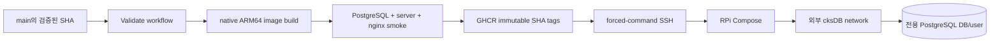

- 운영 Compose는 DB container나 volume을 만들지 않는다.
- server root filesystem은 read-only이고 `/tmp`만 제한된 tmpfs다.
- server는 non-root UID/GID로 실행하고 시작 시 Alembic head를 적용한다.
- 배포 이미지는 40자 commit SHA 태그이며 RPi에서 소스를 빌드하지 않는다.
- 제한 SSH 명령은 `deploy feelmyrythm <sha>`만 허용한다.

운영자가 외부에서 준비해야 할 설정 범주는 다음과 같다. 실제 값은 저장소에 넣지 않는다.

| 범주 | 책임 |
|---|---|
| PostgreSQL | 전용 DB/user, `cksDB` network, backup/restore |
| JWT·OAuth | 충분히 긴 JWT secret, Google client ID |
| 메일 | HTTPS web base URL, SMTP host/from, TLS와 선택 인증 |
| 객체 저장 | S3 bucket/region/credentials, CORS, staging lifecycle |
| 모바일 | signing, AASA/assetlinks, store metadata와 privacy URL |
| 배포 | GHCR access, 제한 deploy key, rollback·post-health 절차 |

실제 값을 주입한 뒤에는 [운영 preflight와 release runbook](./OPERATIONS.md)을 따른다. 기본 preflight는 read-only이며 S3 canary와 test mail은 각각 명시적인 opt-in flag가 있어야만 실행한다.

## 18. 반드시 지킬 불변 조건

1. 박을 네트워크로 스트리밍하지 않는다.
2. 클릭 예약과 시각화의 기준은 `AudioContext` clock이다. 클릭에 `setTimeout`을 쓰지 않는다.
3. `packages/core`는 플랫폼 비의존 순수 함수로 유지한다.
4. 템포맵 수정은 immutable revision을 만들고 충돌은 409로 노출한다.
5. 동기 방은 생성 시 revision과 유효 anchor 집합을 고정한다.
6. 원격 cache는 사용자별이며 실제 network failure에서만 읽기 전용으로 연다.
7. Service Worker에 인증 API 응답을 저장하지 않는다.
8. 외부 객체 삭제를 DB commit보다 먼저 수행하지 않는다.
9. 운영 DB·volume·공용 `cksDB`를 앱 배포가 생성하거나 삭제하지 않는다.
10. 기능 완료와 실기기·실운영 검증 완료를 같은 의미로 보고하지 않는다.
