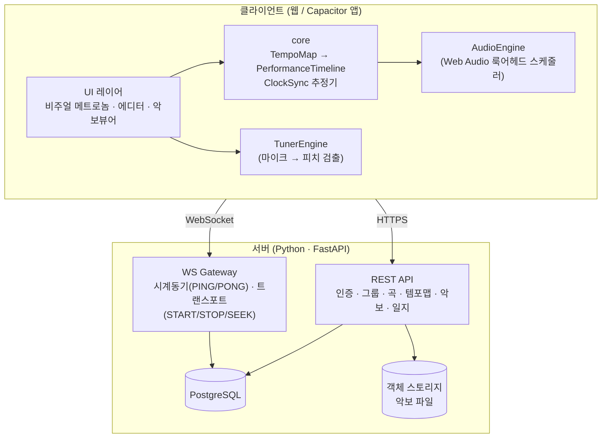
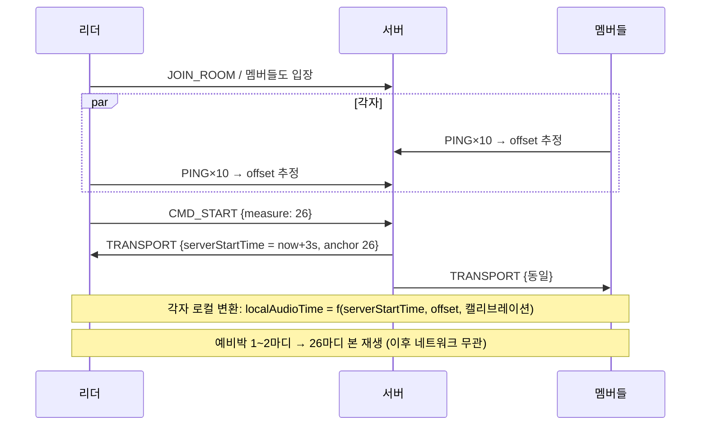
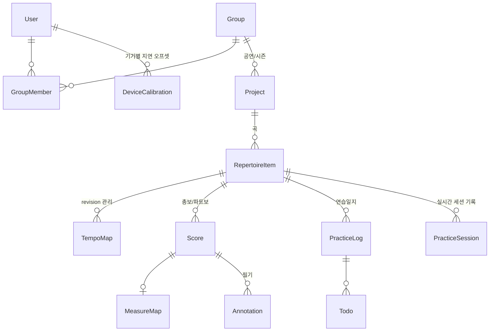

# FeelMyRythm 설계문서

앙상블 연습을 위한 **동기화 메트로놈 + 악보/연습 관리** 애플리케이션.

- 작성일: 2026-08-04
- 상태: 초안 v1.1 (서버 스택을 Python으로 변경)
- 함께 볼 문서: [구현 로드맵](./IMPLEMENTATION_PLAN.md) · [UI 디자인 시스템](./UI_DESIGN.md)

---

## 1. 개요와 목표

### 1.1 한 줄 정의

곡의 템포 구조(박자·BPM 변화·반복)를 "템포맵"으로 정의하고, 앙상블 멤버 전원이 **같은 시각에 같은 박**을 듣고 보게 하는 메트로놈.

### 1.2 기능 우선순위

| 순위 | 기능 | 비고 |
|---|---|---|
| **P0** | 2. 박자 세기 상세 (템포맵: 구간·박자 변화·반복) | 핵심 도메인 |
| **P0** | 3. 박자 공유 (그룹/프로젝트, 실시간 동기 시작, 예비박) | 핵심 차별점 |
| P1 | 1. 메트로놈 기본 (박자 소리, 튜너) | 튜너는 독립 모듈 |
| P1 | 6. 박자 시각화 (공학심리학 기반) | P0와 함께 개발 |
| P2 | 4. 악보 저장 (마디 인식, 총보/파트보 이동, 필기) | |
| P2 | 5. 연습일지 (메모, 지시사항, 할일) | |

### 1.3 설계 전체를 관통하는 원칙

1. **결정론(Determinism)**: 같은 템포맵 + 같은 시작 시각이 주어지면 모든 기기에서 모든 박의 절대 시각이 동일하게 계산된다. 실시간 동기화는 "박 신호를 스트리밍"하는 것이 아니라 **"시계를 맞추고 시작 시각만 합의"** 하는 방식으로 구현한다. (네트워크 지터에 면역)
2. **코어 로직의 순수성**: 템포맵 해석·타임라인 전개·시계 동기화 수학은 DOM/플랫폼 의존성이 없는 순수 TypeScript 패키지로 분리한다. → 테스트 용이, 웹/모바일/서버 재사용.
3. **오디오 우선, 시각은 오디오 시계에 종속**: 화면 갱신은 오디오 클럭을 읽어 렌더링한다. `setTimeout` 기반 시각화 금지.
4. **플랫폼 어댑터 패턴**: 소리 출력·햅틱·파일 접근 등 플랫폼 의존 기능은 인터페이스 뒤에 숨긴다. 웹 구현이 기본, 모바일에서 문제가 생기는 지점만 네이티브 플러그인으로 교체.

---

## 2. 기술 스택 결정

### 2.1 결론 (추천)

| 영역 | 선택 | 
|---|---|
| 언어 | 클라이언트: TypeScript / 서버: **Python 3.13+** |
| 코어/오디오 | 순수 TS 패키지 + Web Audio API (AudioWorklet) — 박 계산·시계동기는 클라이언트에서 실행되므로 TS 유지 |
| 웹 프론트 | **React 19 (최신) + Vite**, PWA |
| UI 스타일 | Tailwind CSS 4 + Radix UI 프리미티브 — 상세는 [UI 디자인 시스템](./UI_DESIGN.md) |
| 모바일 포팅 | **Capacitor** (웹 빌드를 그대로 래핑 + 네이티브 플러그인) |
| 서버 | **Python + FastAPI** (uvicorn/uvloop) — REST + WebSocket 단일 앱. Flask 대비 근거는 §2.3 |
| ORM/마이그레이션 | SQLAlchemy 2 + Alembic |
| DB | **PostgreSQL** (+ Redis: 실시간 세션 상태, 멀티 인스턴스 시) |
| 파일 저장 | S3 호환 스토리지 (악보 PDF/이미지/MusicXML) |
| 모노레포 | pnpm workspaces (JS 측) + uv (Python 서버) |
| 테스트 | Vitest (코어 단위 테스트), pytest (서버), Playwright (E2E) |

### 2.2 왜 Capacitor인가 (대안 비교)

| 기준 | 웹+Capacitor ✅ | React Native | Flutter | PWA만 |
|---|---|---|---|---|
| 웹 개발자 역량 재사용 | 100% | 부분 (RN 학습 필요) | 낮음 (Dart) | 100% |
| 코드 공유율 (웹↔앱) | UI까지 거의 전부 | 로직만, UI 재작업 | 웹은 canvas 렌더로 별도 세계 | 전부 |
| 오디오 정밀 타이밍 | Web Audio로 충분, 필요시 플러그인 | 네이티브 모듈 필수 | 플러그인 필수 | Web Audio |
| iOS 백그라운드/오디오 세션 제어 | 플러그인으로 가능 | 가능 | 가능 | **불가/제한** (탈락 사유) |
| 스토어 배포 | O | O | O | X (iOS 설치 UX 열악) |

- **PWA만으로는 부족한 이유**: iOS Safari는 화면 잠금/백그라운드에서 오디오·타이머를 강하게 제한한다. 연습 중 화면이 꺼지면 메트로놈이 멈추는 것은 치명적. → 네이티브 셸 필요.
- **React Native가 아닌 이유**: 이 앱의 성능 민감 지점은 UI가 아니라 **오디오 스케줄링**이다. RN을 써도 오디오는 결국 네이티브 모듈을 짜야 하므로, UI까지 재작업하는 RN보다 웹 UI를 그대로 쓰고 오디오만 필요시 플러그인화하는 Capacitor가 유리하다.
- **알려진 리스크와 대응**: WKWebView(iOS)의 오디오 출력 지연이 기기별로 다를 수 있음 → §6.5 기기별 캘리브레이션으로 흡수. 그래도 부족하면 `AudioEngine` 인터페이스 구현체만 네이티브(AVAudioEngine/Oboe) 플러그인으로 교체(§5.1). 코어 로직은 무변경.

### 2.3 서버 스택 근거 — Python은 적합, 프레임워크는 Flask보다 FastAPI

**Python 백엔드 자체는 이 앱에 잘 맞는다.** 박 계산·오디오 스케줄링 같은 시간 민감 로직은 전부 클라이언트(TS)에서 돌고, 서버는 CRUD와 WS 중계·타임스탬프만 담당하므로 언어 성능이 병목이 아니다.

단, 실시간 동기화(§6)가 **서버가 타임스탬프를 직접 찍는 NTP 유사 프로토콜**을 요구하므로 프레임워크는 가려 쓴다:

| 기준 | FastAPI ✅ | Flask |
|---|---|---|
| WebSocket | ASGI 네이티브 — 표준 기능 | WSGI라 불가 → Flask-SocketIO + eventlet/gevent 몽키패칭 필요 |
| 비동기 모델 | async/await, 최신 Python 문법 그대로 | 동기 기본. async 지원이 제한적 |
| 시계동기 타임스탬프 품질 | 이벤트 루프(uvloop)에서 수신 즉시 기록 → 지터 작고 예측 가능 | eventlet 협력 스케줄링 아래서 지터 예측이 어려움 |
| 타입·검증 | Pydantic 내장 → OpenAPI 자동 생성 → **프론트 TS 타입 자동 생성** | 별도 라이브러리 조합 필요 |

- Flask로 불가능한 것은 아니다(Flask-SocketIO로 구현 사례 많음). 하지만 이 서버의 핵심이 WS 게이트웨이인 이상, WS가 1급 기능인 FastAPI가 구조적으로 맞다. CRUD 작성 경험도 Flask와 거의 동일한 난이도.
- BaaS 실시간 기능(Firebase RTDB, Supabase Realtime)은 지연 제어가 안 되므로 배제 — 자체 WS 게이트웨이 필수라는 결론은 동일.
- 운영 형태: FastAPI 단일 앱으로 REST + WS를 함께 서빙. **WS 게이트웨이는 단일 프로세스(단일 이벤트 루프)로 시작** — 방 상태가 메모리에 있으므로. 수평 확장이 필요해지면 Redis pub/sub 도입. 서버 시각은 epoch 기준 `time.time_ns()`를 ms로 변환해 사용.

---

## 3. 시스템 아키텍처

### 3.1 모노레포 구조

```
feelmyrythm/
├── packages/
│   ├── core/          # 순수 TS. 템포맵 모델, 타임라인 전개, 시계동기 수학. 의존성 0
│   ├── audio/         # AudioEngine 인터페이스 + WebAudioEngine, TunerEngine(피치 검출)
│   ├── ui/            # React 공용 컴포넌트 (비주얼 메트로놈, 템포맵 에디터, 악보 뷰어)
│   └── protocol/      # 생성된 TS 타입 (원천은 서버 Pydantic 모델 → OpenAPI/JSON Schema)
├── apps/
│   ├── web/           # React 19 + Vite. PWA
│   ├── mobile/        # Capacitor 셸 (web 빌드 래핑) + 네이티브 플러그인
│   └── server/        # Python + FastAPI (uv 관리). REST API + WS 동기화 게이트웨이
└── docs/
```

### 3.2 컴포넌트 다이어그램



### 3.3 데이터 흐름 (앙상블 동기 재생)

1. 리더가 곡을 선택하고 연습 세션(방)을 연다. 멤버들이 방에 입장.
2. 모든 클라이언트가 WS로 시계 동기(§6.2)를 수행해 서버 시계와의 오프셋을 추정.
3. 모든 클라이언트가 같은 revision의 템포맵을 내려받아 **동일한 PerformanceTimeline을 로컬에서 전개**.
4. 리더가 "26마디부터 시작" 누름 → 서버가 `START{measure:26, serverStartTime: now+3s}` 브로드캐스트.
5. 각 클라이언트는 serverStartTime을 자기 오디오 클럭 시각으로 변환하고, 예비박부터 정확히 스케줄.
6. 이후 네트워크가 끊겨도 재생은 로컬에서 결정론적으로 지속된다.

---

## 4. 핵심 도메인 모델: 템포맵 (기능 2)

### 4.1 개념

곡 전체의 시간 구조를 마디 단위로 기술한 것. "몇 마디부터 몇 마디까지 어떤 박자·어떤 템포이고, 어디서 반복하는가"의 선언적 데이터.

### 4.2 타입 정의 (packages/core)

```ts
/** 곡 하나의 템포 구조 전체 */
interface TempoMap {
  id: string;
  repertoireItemId: string;
  revision: number;            // 동기화 시 전원 동일 revision 보장용
  totalMeasures: number;
  anacrusis?: Anacrusis;       // 못갖춘마디 (박 수)
  sections: TempoSection[];    // startMeasure 오름차순, 구간은 서로 겹치지 않음
  jumps: JumpDirective[];      // 반복 구조
  countIn: CountInPolicy;      // 예비박 정책
}

/** 균질한 구간: 이 안에서는 박자·템포가 일정 (또는 선형 변화) */
interface TempoSection {
  id: string;
  label?: string;              // "Intro", "A", "Coda" 등
  startMeasure: number;        // 1-base, 포함
  endMeasure: number;          // 포함
  timeSignature: { num: number; denom: number };   // 4/4, 6/8 ...
  bpm: number;
  beatUnit: NoteValue;         // 무엇을 1박으로 셀지: quarter, dottedQuarter(6/8용) ...
  tempoChange?: { type: 'rit' | 'accel'; targetBpm: number }; // 구간 내 선형 변화(후순위)
  accentPattern?: number[];    // 박별 강세 0~2 (기본: 첫박 강)
  subdivision?: 1 | 2 | 3 | 4; // 분할 클릭 (8분·셋잇단 등)
}

/** 반복·도돌이 구조 — 악보의 진행 지시를 데이터로 표현 */
type JumpDirective =
  | { type: 'repeat';  startMeasure: number; endMeasure: number; times: number;
      endings?: { measures: [number, number]; forPass: number[] }[] }  // 1st/2nd 엔딩(볼타)
  | { type: 'dc'; atMeasure: number; alFine?: number; alCoda?: boolean }   // 다카포
  | { type: 'ds'; atMeasure: number; segnoMeasure: number; alFine?: number; alCoda?: boolean }
  | { type: 'coda'; toCodaMeasure: number; codaMeasure: number };

interface CountInPolicy {
  measures: 1 | 2;             // 예비박 마디 수
  useSectionMeter: true;       // 시작 지점 구간의 박자·템포를 따름
}
```

### 4.3 PerformanceTimeline: 전개(컴파일) 결과

반복 구조가 있는 템포맵은 그대로 재생할 수 없으므로, **연주 순서대로 펼친 선형 타임라인**으로 컴파일한다. 이것이 재생·동기화·악보 하이라이트의 단일 기준이다.

```ts
interface PerformanceTimeline {
  tempoMapRevision: number;
  entries: TimelineMeasure[];  // 연주 순서. 반복되는 마디는 여러 번 등장
  totalDurationSec: number;
}

interface TimelineMeasure {
  measureNumber: number;       // 악보상 마디 번호
  pass: number;                // 몇 번째로 지나가는가 (1st/2nd 엔딩 구분)
  sectionId: string;
  startTimeSec: number;        // 타임라인 시작(t=0) 기준 절대 오프셋
  beats: { timeSec: number; accent: 0 | 1 | 2; isSubdivision: boolean }[];
}
```

**핵심 함수 (모두 순수 함수 → 단위 테스트 대상)**

```ts
expandTimeline(map: TempoMap): PerformanceTimeline
locate(tl: PerformanceTimeline, elapsedSec: number): { entryIndex; beatIndex }  // 이진 탐색
seekPoint(tl: PerformanceTimeline, measure: number, pass?: number): number      // 시작 오프셋(초)
buildCountIn(map: TempoMap, from: seekPoint): Beat[]                            // 예비박 생성
```

사용자 예시 검증: "4/4 ♩=100으로 시작, 26마디에서 ♩=130으로 변경, 반복·2번 엔딩" →
`sections: [{1–25, 4/4, 100}, {26–…, 4/4, 130}]` + `jumps: [{repeat, …, endings: […]}]` 로 표현 가능.

### 4.4 편집기 UX 요건 (요약)

- 구간 리스트 편집(표 형태) + 마디 눈금 타임라인 뷰(구간을 색 블록으로 시각화) 병행.
- 탭 템포(화면 두드려 BPM 측정), 구간 분할("이 마디에서 나누기"), 검증(구간 빈틈/겹침, 반복 무한루프 검출은 `expandTimeline`이 담당).
- 악보가 연결된 경우(§7) 마디 클릭 → 해당 마디에서 구간 나누기.

---

## 5. 오디오·타이밍 엔진

### 5.1 AudioEngine 인터페이스 (플랫폼 어댑터)

```ts
interface AudioEngine {
  /** 절대 시각(오디오 클럭 기준)에 클릭음 예약 */
  scheduleClick(atAudioTime: number, kind: 'downbeat' | 'beat' | 'sub' | 'countIn'): void;
  now(): number;                    // 오디오 클럭 현재 시각 (초)
  outputLatencySec(): number;       // 추정 출력 지연
  start(): Promise<void>; stop(): void;
}
```

- 기본 구현: `WebAudioEngine` (웹·Capacitor 공용).
- iOS/Android에서 지연·백그라운드 문제가 실측으로 확인될 때만 `NativeAudioEngine`(Capacitor 플러그인, AVAudioEngine/Oboe)을 추가. 상위 코드는 무변경.

### 5.2 룩어헤드 스케줄러 (Two Clocks 패턴)

JS 타이머(`setTimeout`)는 수십 ms 지터가 있으므로 소리 발생 자체에 쓰지 않는다.

```
[Web Worker 타이머, 25ms 주기]
  └─ tick(): 지금부터 120ms 안에 도래할 박을 타임라인에서 찾아
             audioCtx 절대시각으로 AudioBufferSourceNode.start(t) 예약
             → 예약된 박을 beatQueue에 push (시각화용)

[메인 스레드 rAF 루프]
  └─ audioTime = engine.now() 를 읽어 locate() → 현재 박 위치 렌더
```

- 타이머를 **Web Worker**에서 돌리는 이유: 백그라운드 탭에서 메인 스레드 타이머가 1s+로 스로틀되는 것을 회피.
- 클릭음은 실시간 합성(oscillator) 대신 **미리 디코드한 짧은 샘플 버퍼** 사용 (다운비트/일반박/분할박/예비박 4종, 음높이·음색 구분).
- 템포·구간 변경이 재생 중 일어나면: 다음 마디 경계에서 새 타임라인으로 전환 (경계 정렬 재계산).

### 5.3 예비박 (Count-in)

- `seekPoint` 시각 앞에 시작 구간의 박자·템포로 1–2마디의 예비박을 삽입.
- 소리: 본 박과 구별되는 음색(높은 우드블록 등). 시각: 카운트다운 숫자(§9).
- 동기 세션에서는 `serverStartTime`이 **예비박의 첫 박** 시각이 되도록 정의한다 (전원 같은 예비박을 들음).

---

## 6. 실시간 동기화 프로토콜 (기능 3)

### 6.1 목표와 접근

- 목표: 같은 방의 모든 기기에서 체감 동시성 (오디오 기준 오차 ±10ms 내, 최악 30ms).
- 접근: **박 스트리밍이 아니라 시계 합의**. 서버는 "무엇을(템포맵 revision), 어디서(마디), 언제(서버시각)" 만 브로드캐스트하고, 소리·화면은 전부 로컬에서 결정론적으로 생성. → 시작 후에는 네트워크 품질과 무관.

### 6.2 시계 동기 (NTP 유사, WS 위에서)

```
client                          server
  t0 ── PING {t0} ──────────▶
                               t1 (수신·응답 시각)
  t2 ◀── PONG {t0, t1} ──────
  offset = t1 - (t0 + t2)/2     rtt = t2 - t0
```

- 입장 직후 10회 버스트 → **RTT 최소 표본의 offset 채택** (min-RTT 필터, 비대칭 지연 영향 최소화).
- 이후 10초 주기로 재측정, 지수평활로 드리프트 보정. RTT가 급증한 표본은 폐기.
- 클라이언트 내부 시계 사상: `serverTime ↔ performance.now() ↔ audioCtx.currentTime` 두 단계 매핑을 유지 (audio clock과 monotonic clock의 대응은 주기적으로 샘플링).
- 기대 정밀도: 동일 Wi-Fi에서 offset 오차 1–5ms. **실제 지배 요인은 네트워크가 아니라 §6.5 출력 지연**이다.

### 6.3 세션(방)과 트랜스포트 상태

```ts
// 서버가 방마다 유지하는 단일 진실
interface TransportState {
  roomId: string;
  tempoMapId: string; revision: number;
  status: 'idle' | 'armed' | 'playing';
  anchor?: { measure: number; pass: number };
  serverStartTime?: number;   // 예비박 첫 박의 서버 시각 (epoch ms)
}
```

**WS 메시지 (packages/protocol)**

| 방향 | 메시지 | 내용 |
|---|---|---|
| C→S | `JOIN_ROOM` | roomId, 인증 토큰 |
| C↔S | `PING`/`PONG` | 시계 동기 (§6.2) |
| C→S | `CMD_START` | anchor(마디), 리더/권한자만 |
| C→S | `CMD_STOP`, `CMD_SEEK` | |
| S→C | `TRANSPORT` | TransportState 전체 (모든 변경 시 + 입장 시) |
| S→C | `TEMPOMAP_UPDATED` | revision 변경 → 클라 재요청, 재생 중이면 다음 마디 경계 적용 |
| S→C | `ROOM_ROSTER` | 참가자·준비 상태 표시용 |

- `CMD_START` 처리: 서버는 `serverStartTime = serverNow + lead`(기본 3초, 최악 RTT·재생준비 여유) 를 찍어 `TRANSPORT` 브로드캐스트.
- **늦게 합류/재접속**: 타임라인이 결정론적이므로 `elapsed = serverNow - serverStartTime` 으로 현재 위치를 계산해 **다음 마디 경계부터** 합류(중간부터 소리 냄). 시퀀스 재전송 불필요.
- 서버 상태는 메모리 + (멀티 인스턴스 시) Redis. 방은 마지막 참가자 퇴장 후 일정 시간 뒤 소멸.

### 6.4 동기 시작 시퀀스



### 6.5 출력 지연 캘리브레이션 (실사용 품질의 핵심)

- 기기·출력장치별 오디오 파이프라인 지연이 수십~수백 ms 편차 (특히 **블루투스 스피커/이어폰 100–300ms**).
- 대응:
  1. `AudioContext.outputLatency`/`baseLatency` 자동 반영 (지원 브라우저).
  2. **수동 캘리브레이션 화면**: 테스트 클릭에 맞춰 탭 → 중앙값으로 기기 오프셋 산출, 기기+출력장치 조합별 저장.
  3. 세션 UI에 각 참가자의 RTT·캘리브레이션 여부 표시, 블루투스 감지 시 경고.
- 시각 표시는 오디오보다 별도 오프셋(디스플레이 지연 ~1프레임)을 둔다.

---

## 7. 악보 처리 (기능 2의 마디 세기 + 기능 4)

### 7.1 입력 포맷별 전략

| 포맷 | 마디 인식 | 렌더링 | 비고 |
|---|---|---|---|
| **MusicXML** (.musicxml/.mxl) | **자동·정확** — 마디 수, 박자표, 템포 지시, 도돌이까지 파싱 → **템포맵 초안 자동 생성** | OSMD(OpenSheetMusicDisplay) 또는 Verovio | 최우선 지원 경로 |
| PDF | 수동 매핑 기본 + (후순위) 서버측 OMR(Audiveris)로 초안 보조 | PDF.js | OMR은 베스트 에포트로 고지 |
| 이미지 (스캔/사진) | PDF와 동일 | 이미지 뷰어 | |

- **수동 마디 매핑 도구**: 시스템(단) 단위로 드래그 → 마디 경계선 클릭으로 분할 → 마디 번호 자동 부여(시작 번호·못갖춘마디 보정 가능). 페이지당 1분 내 작업이 목표. 결과물이 `MeasureMap`.

```ts
interface MeasureMap {
  scoreId: string;
  regions: { page: number; measureNumber: number;
             rect: { x: number; y: number; w: number; h: number } }[]; // 페이지 정규화 좌표
  measureNumberOffset: number;  // 파트보별 번호 어긋남 보정
}
```

### 7.2 마디 기반 내비게이션

- 곡(RepertoireItem)에 속한 모든 악보(총보·파트보들)는 **마디 번호라는 공통 좌표계**를 공유한다.
- 악보에서 마디 탭 → 메트로놈 seek / "여기부터 시작" 동기 명령.
- 재생 중: 현재 `TimelineMeasure.measureNumber` 에 해당하는 region 하이라이트 + 자동 페이지 넘김.
- 총보↔파트보 전환: 현재 마디 번호 유지한 채 다른 Score의 같은 마디로 점프 (`measureNumberOffset` 적용).

### 7.3 필기·주석 레이어

- 악보 위 벡터 오버레이(SVG/캔버스): 펜 스트로크, 텍스트, 셈여림·기호 스탬프.
- 앵커: 페이지 정규화 좌표 또는 마디 번호(마디 앵커면 파트보 간 이동에도 따라옴).
- 저장은 JSON(원본 파일 불변). 공유 범위: 개인 / 프로젝트 공유. 실시간 공동 필기는 후순위(단순 last-write-wins부터).

---

## 8. 데이터 모델



주요 컬럼 메모:

- `GroupMember.role`: owner / leader / member — leader 이상만 동기 세션에서 트랜스포트 조작.
- `TempoMap`: JSON 컬럼(sections, jumps) + `revision` 정수. 수정 시 revision 증가 (동기화 일관성 근거).
- `Score.kind`: full(총보) | part, `instrument`, 파일은 S3 키 참조.
- `Annotation.scope`: private | project.
- `PracticeLog`: 마크다운 본문 + 마디/악보 위치 앵커 참조 가능. `Todo`: 내용, 담당자, 기한, 완료 여부.
- `DeviceCalibration`: userId + 기기 지문 + 출력장치 라벨 → offsetMs.

---

## 9. 박자 시각화 설계 (기능 6, 공학심리학 근거)

| 설계 결정 | 근거 |
|---|---|
| 연속 진자(펜듈럼) 대신 **이산 플래시 + 채움(fill) 예측 큐** | 움직이는 진자의 위상 판독은 시각 추적 부하가 큼. 반면 "다음 박까지 차오르는" 채움 애니메이션은 지휘자의 예비 동작처럼 **박 도래 시점을 예측**하게 해줌 (앙상블 진입에 필수) |
| 다운비트는 **색 + 크기 + 위치** 삼중 부호화 | 전주의적(preattentive) 속성 중복 부호화. 색맹 사용자를 위해 색 단독 의존 금지 |
| 마디 내 박 위치를 고정 슬롯(4/4면 4칸)으로 표시 | 공간적 위치는 순간 판독이 가장 빠른 채널. "지금 몇 박인지"를 세지 않고 봄 |
| 전체 화면 플래시 모드 (보면대 거치용) | 주변시(peripheral vision)는 형태 인식은 약하지만 **깜빡임·움직임에 민감** → 악보를 보면서도 곁눈으로 박 인지 가능 |
| 예비박은 큰 숫자 카운트다운(4·3·2·1) + 구별되는 색 | 시작 시점의 불확실성 제거, 인지 부하 최소화 |
| 고대비·대형 요소, 원거리 가독 기준 | 합주실에서 수 m 거리 시인성 |
| 렌더링은 오디오 클럭 기준 rAF | 시각-청각 어긋남(>20ms)은 즉시 위화감 유발. §5.2 |
| 모바일: 햅틱 채널 추가 (Capacitor Haptics) | 다중 감각 중복 부호화, 소음 환경 대응 |
| 현재 마디 번호·구간 라벨·다음 템포 변화 예고("3마디 뒤 ♩=130") 상시 표시 | 상황 인식(situation awareness) 지원 |

---

## 10. 튜너 (기능 1)

- `getUserMedia` → `AudioWorklet` 에서 프레임 수집 → 피치 검출은 **MPM(McLeod Pitch Method) 또는 YIN** (자기상관 계열, 단음 악기에 강건). 창 2048–4096 샘플.
- 표시: 음이름 + 센트 편차 바늘(±50센트), 안정화 필터(중앙값).
- 기준음 A4 조절 가능: 440 기본, 415/430/442/443 프리셋 (고악기·오케스트라 대응).
- 완전 독립 모듈 — 다른 기능과 의존성 없음.

---

## 11. API 개요

### REST (FastAPI, JWT 인증)

```
POST /auth/…                      # 가입/로그인 (이메일 + OAuth)
CRUD /groups, /groups/:id/members
CRUD /projects, /projects/:id/repertoire
CRUD /repertoire/:id/tempomap     # PUT 시 revision++
POST /repertoire/:id/scores       # presigned upload → 완료 콜백
CRUD /scores/:id/measure-map, /scores/:id/annotations
CRUD /repertoire/:id/logs, /logs/:id/todos
POST /rooms                       # 연습 세션 개설 → roomId
```

### WebSocket

§6.3의 메시지 표 참조.

**타입 단일 원천 전략**: 서버의 Pydantic 모델(REST DTO + WS 메시지)이 원천이다. FastAPI가 내보내는 OpenAPI/JSON Schema에서 `openapi-typescript`로 TS 타입을 생성해 `packages/protocol`에 커밋 → 클라(TS)와 서버(Python)가 항상 같은 스키마로 검증한다. 스키마 변경 시 CI에서 생성물 불일치를 검출.

---

## 12. 비기능 요구사항 · 리스크

| 항목 | 기준 / 대응 |
|---|---|
| 박 타이밍 정밀도 (로컬) | 오디오 클럭 예약 기준 지터 < 1ms (룩어헤드 스케줄링으로 보장) |
| 동기 오차 (기기 간) | 목표 ±10ms. 지배 요인은 출력 지연 → 캘리브레이션 필수 UX로 |
| 백그라운드 동작 | 모바일 앱: 오디오 세션 유지 + 화면 꺼짐 방지 옵션. 웹: Worker 타이머 + Wake Lock API |
| 블루투스 출력 | 100–300ms 지연. 감지 시 경고 + 캘리브레이션 유도. 앙상블 모드에선 유선/내장 스피커 권장 안내 |
| OMR 정확도 | 자동 인식은 초안 생성 보조로 포지셔닝. 수동 매핑 도구가 항상 기본 경로 |
| 오프라인 | 템포맵·악보 로컬 캐시(IndexedDB) → 솔로 연습은 완전 오프라인 가능. 동기 세션만 온라인 필수 |
| 확장 | WS 게이트웨이 수평 확장 시 Redis pub/sub. 초기엔 단일 인스턴스 |
