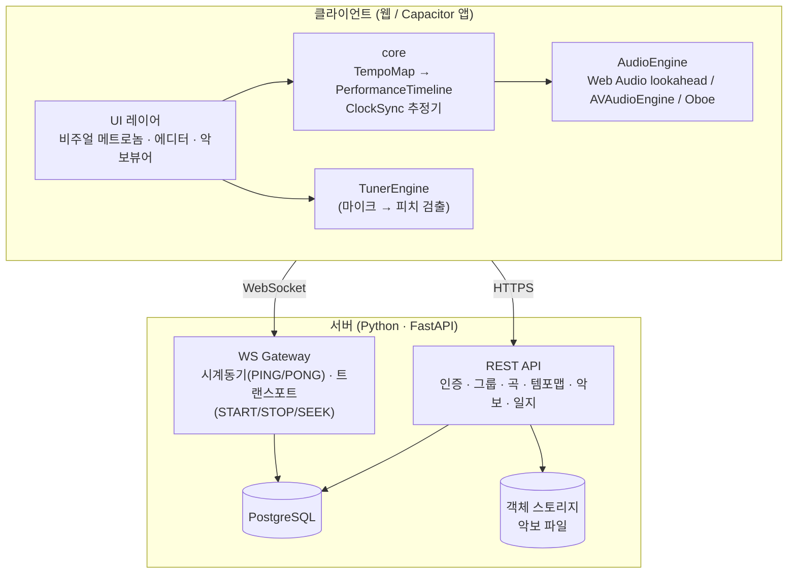
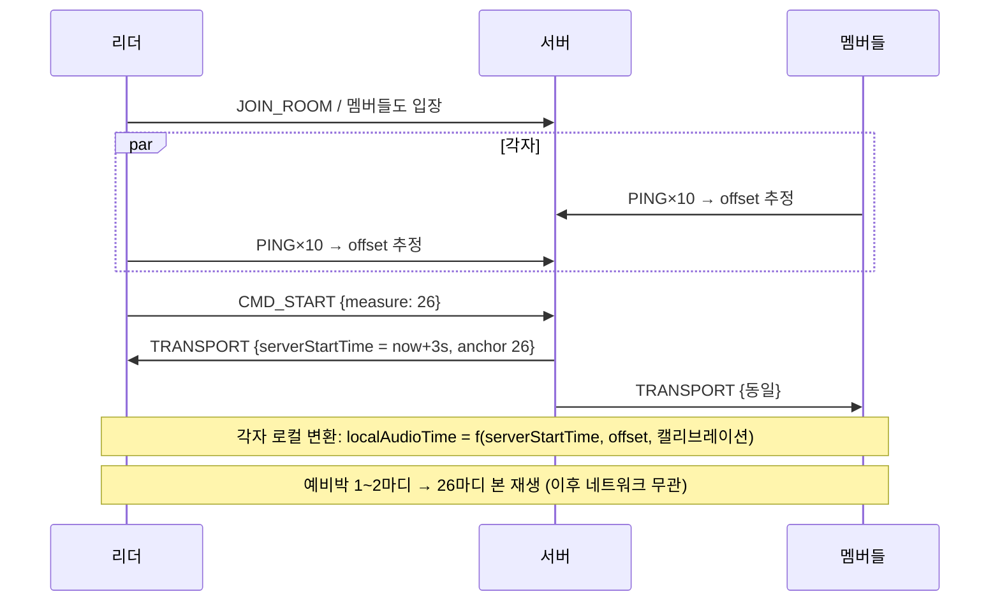
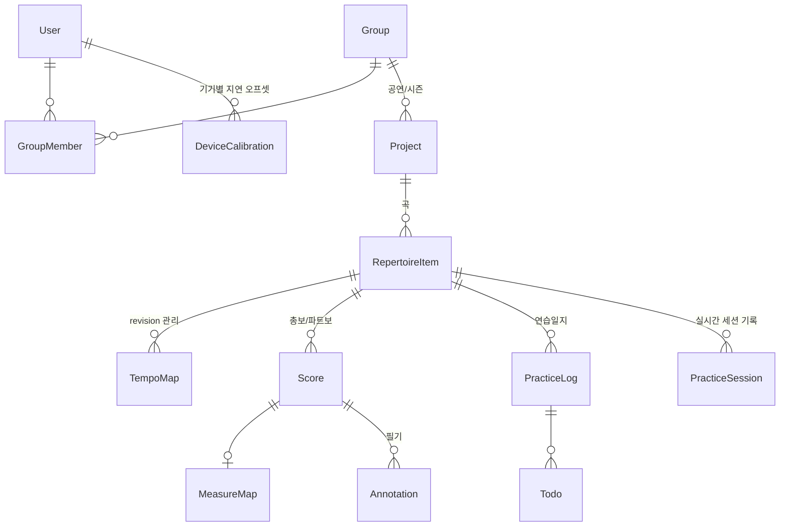

# FeelMyRythm 설계문서

앙상블 연습을 위한 **동기화 메트로놈 + 악보/연습 관리** 애플리케이션.

- 작성일: 2026-08-04
- 상태: 초안 v1.1 (서버 스택을 Python으로 변경)
- 함께 볼 문서: [구현 로드맵](./IMPLEMENTATION_PLAN.md) · [UI 디자인 시스템](./UI_DESIGN.md)

---

## 1. 개요와 목표

### 1.1 한 줄 정의

곡의 템포 구조(박자·BPM 변화·반복)를 "템포맵"으로 정의하고, 앙상블 멤버 전원이 **같은 시각에 같은 박**을 듣고 보게 하는 메트로놈.

### 1.2 기능 우선순위

| 순위 | 기능 | 비고 |
|---|---|---|
| **P0** | 2. 박자 세기 상세 (템포맵: 구간·박자 변화·반복) | 핵심 도메인 |
| **P0** | 3. 박자 공유 (그룹/프로젝트, 실시간 동기 시작, 예비박) | 핵심 차별점 |
| P1 | 1. 메트로놈 기본 (박자 소리, 튜너) | 튜너는 독립 모듈 |
| P1 | 6. 박자 시각화 (공학심리학 기반) | P0와 함께 개발 |
| P2 | 4. 악보 저장 (마디 인식, 총보/파트보 이동, 필기) | |
| P2 | 5. 연습일지 (메모, 지시사항, 할일) | |

### 1.3 설계 전체를 관통하는 원칙

1. **결정론(Determinism)**: 같은 템포맵 + 같은 시작 시각이 주어지면 모든 기기에서 모든 박의 절대 시각이 동일하게 계산된다. 실시간 동기화는 "박 신호를 스트리밍"하는 것이 아니라 **"시계를 맞추고 시작 시각만 합의"** 하는 방식으로 구현한다. (네트워크 지터에 면역)
2. **코어 로직의 순수성**: 템포맵 해석·타임라인 전개·시계 동기화 수학은 DOM/플랫폼 의존성이 없는 순수 TypeScript 패키지로 분리한다. → 테스트 용이, 웹/모바일/서버 재사용.
3. **오디오 우선, 시각은 오디오 시계에 종속**: 화면 갱신은 오디오 클럭을 읽어 렌더링한다. `setTimeout` 기반 시각화 금지.
4. **플랫폼 어댑터 패턴**: 소리 출력·햅틱·파일 접근 등 플랫폼 의존 기능은 인터페이스 뒤에 숨긴다. 웹 구현이 기본, 모바일에서 문제가 생기는 지점만 네이티브 플러그인으로 교체.

---

## 2. 기술 스택 결정

### 2.1 결론 (추천)

| 영역 | 선택 | 
|---|---|
| 언어 | 클라이언트: TypeScript / 서버: **Python 3.13+** |
| 코어/오디오 | 순수 TS 타임라인·시계동기 + 웹 Web Audio / 모바일 AVAudioEngine·Oboe 어댑터 |
| 웹 프론트 | **React 19 (최신) + Vite**, PWA |
| UI 스타일 | Tailwind CSS 4 + Radix UI 프리미티브 — 상세는 [UI 디자인 시스템](./UI_DESIGN.md) |
| 모바일 포팅 | **Capacitor** (웹 빌드를 그대로 래핑 + 네이티브 플러그인) |
| 서버 | **Python + FastAPI** (uvicorn/uvloop) — REST + WebSocket 단일 앱. Flask 대비 근거는 §2.3 |
| ORM/마이그레이션 | SQLAlchemy 2 + Alembic |
| DB | **PostgreSQL** (+ Redis: 실시간 세션 상태, 멀티 인스턴스 시) |
| 파일 저장 | S3 호환 스토리지 (악보 PDF/이미지/MusicXML) |
| 모노레포 | pnpm workspaces (JS 측) + uv (Python 서버) |
| 테스트 | Vitest (코어 단위 테스트), pytest (서버), Playwright (E2E) |

### 2.2 왜 Capacitor인가 (대안 비교)

| 기준 | 웹+Capacitor ✅ | React Native | Flutter | PWA만 |
|---|---|---|---|---|
| 웹 개발자 역량 재사용 | 100% | 부분 (RN 학습 필요) | 낮음 (Dart) | 100% |
| 코드 공유율 (웹↔앱) | UI까지 거의 전부 | 로직만, UI 재작업 | 웹은 canvas 렌더로 별도 세계 | 전부 |
| 오디오 정밀 타이밍 | Web Audio + 네이티브 플러그인 구현 | 네이티브 모듈 필수 | 플러그인 필수 | Web Audio |
| iOS 백그라운드/오디오 세션 제어 | 플러그인으로 가능 | 가능 | 가능 | **불가/제한** (탈락 사유) |
| 스토어 배포 | O | O | O | X (iOS 설치 UX 열악) |

- **PWA만으로는 부족한 이유**: iOS Safari는 화면 잠금/백그라운드에서 오디오·타이머를 강하게 제한한다. 연습 중 화면이 꺼지면 메트로놈이 멈추는 것은 치명적. → 네이티브 셸 필요.
- **React Native가 아닌 이유**: 이 앱의 성능 민감 지점은 UI가 아니라 **오디오 스케줄링**이다. RN을 써도 오디오는 결국 네이티브 모듈을 짜야 하므로, UI까지 재작업하는 RN보다 웹 UI를 그대로 쓰고 오디오만 필요시 플러그인화하는 Capacitor가 유리하다.
- **알려진 리스크와 대응**: WKWebView 타이머 중단을 오디오 경로에서 제거하기 위해 `AudioEngine` 인터페이스 뒤에 AVAudioEngine/Oboe 구현을 둔다(§5.1). 기기별 출력 지연은 §6.5 캘리브레이션으로 흡수하고 실제 파형으로 최종 검증한다. 코어 로직은 플랫폼과 무관하다.
- **native 인증 경계**: Google Identity Services의 웹 button은 Capacitor WebView에서 신뢰할 수 있는 native 로그인으로 간주하지 않는다. Sign in with Apple과 native Google 연동 전까지 모든 Capacitor 빌드는 Google button/SDK를 숨기고 이메일 가입·로그인·복구만 제공한다. 브라우저 배포는 기존 Google 로그인을 유지한다.

### 2.3 서버 스택 근거 — Python은 적합, 프레임워크는 Flask보다 FastAPI

**Python 백엔드 자체는 이 앱에 잘 맞는다.** 박 계산·오디오 스케줄링 같은 시간 민감 로직은 전부 클라이언트(TS)에서 돌고, 서버는 CRUD와 WS 중계·타임스탬프만 담당하므로 언어 성능이 병목이 아니다.

단, 실시간 동기화(§6)가 **서버가 타임스탬프를 직접 찍는 NTP 유사 프로토콜**을 요구하므로 프레임워크는 가려 쓴다:

| 기준 | FastAPI ✅ | Flask |
|---|---|---|
| WebSocket | ASGI 네이티브 — 표준 기능 | WSGI라 불가 → Flask-SocketIO + eventlet/gevent 몽키패칭 필요 |
| 비동기 모델 | async/await, 최신 Python 문법 그대로 | 동기 기본. async 지원이 제한적 |
| 시계동기 타임스탬프 품질 | 이벤트 루프(uvloop)에서 수신 즉시 기록 → 지터 작고 예측 가능 | eventlet 협력 스케줄링 아래서 지터 예측이 어려움 |
| 타입·검증 | Pydantic 내장 → OpenAPI 자동 생성 → **프론트 TS 타입 자동 생성** | 별도 라이브러리 조합 필요 |

- Flask로 불가능한 것은 아니다(Flask-SocketIO로 구현 사례 많음). 하지만 이 서버의 핵심이 WS 게이트웨이인 이상, WS가 1급 기능인 FastAPI가 구조적으로 맞다. CRUD 작성 경험도 Flask와 거의 동일한 난이도.
- BaaS 실시간 기능(Firebase RTDB, Supabase Realtime)은 지연 제어가 안 되므로 배제 — 자체 WS 게이트웨이 필수라는 결론은 동일.
- 운영 형태: FastAPI 앱이 REST + WS를 함께 서빙한다. production은 공유 Redis에 room metadata·participant presence·분산 lock을 두고 pub/sub으로 각 인스턴스의 로컬 WebSocket에 transport/roster/replacement를 fan-out한다. 서버 시각은 epoch 기준 `time.time_ns()`를 ms로 변환해 사용한다.

---

## 3. 시스템 아키텍처

### 3.1 모노레포 구조

```
feelmyrythm/
├── packages/
│   ├── core/          # 순수 TS. 템포맵 모델, 타임라인 전개, 시계동기 수학. 의존성 0
│   ├── audio/         # AudioEngine 인터페이스 + WebAudioEngine, TunerEngine(피치 검출)
│   ├── ui/            # React 공용 컴포넌트 (비주얼 메트로놈, 템포맵 에디터, 악보 뷰어)
│   └── protocol/      # 생성된 TS 타입 (원천은 서버 Pydantic 모델 → OpenAPI/JSON Schema)
├── apps/
│   ├── web/           # React 19 + Vite. PWA
│   ├── mobile/        # Capacitor 셸 (web 빌드 래핑) + 네이티브 플러그인
│   └── server/        # Python + FastAPI (uv 관리). REST API + WS 동기화 게이트웨이
└── docs/
```

### 3.2 컴포넌트 다이어그램



### 3.3 데이터 흐름 (앙상블 동기 재생)

1. 리더가 곡을 선택하고 연습 세션(방)을 연다. 멤버들이 방에 입장.
2. 모든 클라이언트가 WS로 시계 동기(§6.2)를 수행해 서버 시계와의 오프셋을 추정.
3. 모든 클라이언트가 같은 revision의 템포맵을 내려받아 **동일한 PerformanceTimeline을 로컬에서 전개**.
4. 리더가 "26마디부터 시작" 누름 → 서버가 `START{measure:26, serverStartTime: now+3s}` 브로드캐스트.
5. 각 클라이언트는 serverStartTime을 자기 오디오 클럭 시각으로 변환하고, 예비박부터 정확히 스케줄.
6. 이후 네트워크가 끊겨도 재생은 로컬에서 결정론적으로 지속된다.

### 3.4 인증·계정 보안 흐름

- 이메일 가입 첫 요청은 이름과 이메일만 저장하고 password hash나 세션을 만들지 않는다. 메일 링크의 `verificationToken`은 purpose·email·`auth_generation`·만료에 묶이며, 재발급 전에 generation을 올려 이전 링크를 무효화한다. 링크 소유자가 별도 화면에서 새 password와 확인값을 제출한 때에만 legacy 미검증 hash를 덮어쓰고 검증 시각·새 generation·세션 발급을 한 transaction 흐름으로 완료한다.
- 비밀번호 재설정 요청은 등록 여부와 무관하게 같은 202 응답을 보낸다. reset token은 purpose·email·generation·만료에 묶고, 성공 시 generation 증가와 모든 refresh session 삭제로 한 번만 쓸 수 있게 한다. 브라우저/앱은 verification/reset token을 URL fragment에서 즉시 지우고 메모리에만 두며, 새로고침 뒤에는 메일 링크를 다시 열도록 안내한다.
- 가입·재발급·reset·Google-only 탈퇴 확인 메일은 SMTP enqueue **전에** 사용자별 last-attempt를 commit한다. provider timeout과 bounded queue overflow도 `Retry-After` cooldown을 유지한다. SMTP I/O는 고정 worker 수·bounded queue의 비동기 delivery manager로 요청 밖에서 수행하고, queue full/provider 오류 로그에는 recipient나 서명 URL을 남기지 않는다. shutdown은 제한 시간까지 drain한 뒤 아직 시작하지 않은 job을 취소한다. 운영은 SMTP, absolute HTTPS `FMR_WEB_APP_BASE_URL`, query/fragment 없는 absolute HTTPS `FMR_PUBLIC_API_BASE_URL`이 유효하지 않으면 시작하지 않는다.
- password login은 계정 없음·비활성·미검증·Google-only에도 고정 dummy bcrypt를 실행하고, bounded 전역 verifier로 동시 bcrypt CPU 작업을 제한한다. client IP/CAPTCHA/provider quota 제한은 trusted CDN/nginx/provider에서 수행하며 앱은 임의 `X-Forwarded-For`를 신뢰하지 않는다.
- 검증된 Google 이메일이 미검증 선점 row와 같으면 그 row에 subject를 연결하고 legacy password·refresh session을 제거하며 generation을 올린다. 이미 다른 Google subject나 별도 계정에 연결된 충돌은 409다.
- password 계정 탈퇴는 현재 password를 다시 검증한다. Google-only 계정은 브라우저에서 audience·verified email·subject를 다시 검증한 Google ID token을 쓰거나, native에서도 열 수 있는 purpose=`account_delete` 만료 메일 token을 쓴다. 후자는 email·Google subject·generation에 묶고 fragment에서 즉시 제거해 메모리에만 보관한다.

### 3.5 웹 런타임·화면 상태 경계

- 웹 bootstrap은 React App을 import·mount하기 전 Cache Storage의 구형 `fmr-api`를 fail-closed로 purge한다. 그런 다음 `sw.js?fmr-safety=v1`을 `updateViaCache: none`으로 등록해 제어권 이관과 구형 same-scope worker의 `redundant`를 확인하고, 전환 중 마지막 legacy fetch가 캐시를 다시 만든 경우까지 마지막 purge로 제거한다. 캐시 상태·삭제·제어권을 증명하지 못하면 보안 시작 화면에 머물고 재시도만 허용한다.
- Workbox는 `/feelmyrythm/api/*`를 navigation fallback과 runtime cache에서 제외하고, nginx API proxy는 `Cache-Control: no-store`를 항상 부여한다. 오프라인 데이터는 Service Worker 응답 캐시가 아니라 계정별 IndexedDB snapshot만 사용한다.
- AppShell은 단일 본문 scroller의 좌표를 history entry key별로 보존해 POP에서만 복원하고 새 탐색은 맨 위에서 시작한다. 탐색 후 새 `h1`에 focus하며 browser POP은 모바일 더보기 overlay를 닫는다.
- workspace의 `/groups`는 전체 shape을 결정하는 권위 root 요청이다. 그 후 members·projects·repertoire leaf는 최대 6개만 동시 실행하고 `allSettled`로 건강한 그룹·곡을 유지하며, 실패한 영역은 위치와 재시도를 별도로 노출한다.
- PWA manifest는 `/feelmyrythm/` `id`·scope·start URL, `ko-KR`·category·standalone metadata, 별도의 `any`/`maskable` PNG와 180px Apple touch icon을 제공한다. theme 변경은 페이지 `data-theme`과 `theme-color`, Capacitor SystemBars를 함께 갱신하며 storage·native 실패는 웹 UI를 중단하지 않는다.

---

## 4. 핵심 도메인 모델: 템포맵 (기능 2)

### 4.1 개념

곡 전체의 시간 구조를 마디 단위로 기술한 것. "몇 마디부터 몇 마디까지 어떤 박자·어떤 템포이고, 어디서 반복하는가"의 선언적 데이터.

### 4.2 타입 정의 (packages/core)

```ts
/** 곡 하나의 템포 구조 전체 */
interface TempoMap {
  id: string;
  repertoireItemId: string;
  revision: number;            // 동기화 시 전원 동일 revision 보장용
  totalMeasures: number;
  anacrusis?: Anacrusis;       // 못갖춘마디 (박 수)
  sections: TempoSection[];    // startMeasure 오름차순, 구간은 서로 겹치지 않음
  jumps: JumpDirective[];      // 반복 구조
  countIn: CountInPolicy;      // 예비박 정책
}

/** 균질한 구간: 이 안에서는 박자·템포가 일정 (또는 선형 변화) */
interface TempoSection {
  id: string;
  label?: string;              // "Intro", "A", "Coda" 등
  startMeasure: number;        // 1-base, 포함
  endMeasure: number;          // 포함
  timeSignature: { num: number; denom: number };   // 4/4, 6/8 ...
  bpm: number;
  beatUnit: NoteValue;         // 무엇을 1박으로 셀지: quarter, dottedQuarter(6/8용) ...
  tempoChange?: { type: 'rit' | 'accel'; targetBpm: number }; // 구간 내 선형 변화(후순위)
  accentPattern?: number[];    // 박별 강세 0~2 (기본: 첫박 강)
  subdivision?: 1 | 2 | 3 | 4; // 분할 클릭 (8분·셋잇단 등)
}

/** 반복·도돌이 구조 — 악보의 진행 지시를 데이터로 표현 */
type JumpDirective =
  | { type: 'repeat';  startMeasure: number; endMeasure: number; times: number;
      endings?: { measures: [number, number]; forPass: number[] }[] }  // 1st/2nd 엔딩(볼타)
  | { type: 'dc'; atMeasure: number; alFine?: number; alCoda?: boolean }   // 다카포
  | { type: 'ds'; atMeasure: number; segnoMeasure: number; alFine?: number; alCoda?: boolean }
  | { type: 'coda'; toCodaMeasure: number; codaMeasure: number };

interface CountInPolicy {
  measures: 1 | 2;             // 예비박 마디 수
  useSectionMeter: true;       // 시작 지점 구간의 박자·템포를 따름
}
```

### 4.3 PerformanceTimeline: 전개(컴파일) 결과

반복 구조가 있는 템포맵은 그대로 재생할 수 없으므로, **연주 순서대로 펼친 선형 타임라인**으로 컴파일한다. 이것이 재생·동기화·악보 하이라이트의 단일 기준이다.

```ts
interface PerformanceTimeline {
  tempoMapRevision: number;
  entries: TimelineMeasure[];  // 연주 순서. 반복되는 마디는 여러 번 등장
  totalDurationSec: number;
}

interface TimelineMeasure {
  measureNumber: number;       // 악보상 마디 번호
  pass: number;                // 몇 번째로 지나가는가 (1st/2nd 엔딩 구분)
  sectionId: string;
  startTimeSec: number;        // 타임라인 시작(t=0) 기준 절대 오프셋
  beats: { timeSec: number; accent: 0 | 1 | 2; isSubdivision: boolean }[];
}
```

**핵심 함수 (모두 순수 함수 → 단위 테스트 대상)**

```ts
expandTimeline(map: TempoMap): PerformanceTimeline
locate(tl: PerformanceTimeline, elapsedSec: number): { entryIndex; beatIndex }  // 이진 탐색
seekPoint(tl: PerformanceTimeline, measure: number, pass?: number): number      // 시작 오프셋(초)
buildCountIn(map: TempoMap, from: seekPoint): Beat[]                            // 예비박 생성
```

사용자 예시 검증: "4/4 ♩=100으로 시작, 26마디에서 ♩=130으로 변경, 반복·2번 엔딩" →
`sections: [{1–25, 4/4, 100}, {26–…, 4/4, 130}]` + `jumps: [{repeat, …, endings: […]}]` 로 표현 가능.

### 4.4 편집기 UX 요건 (요약)

- 구간 리스트 편집(표 형태) + 마디 눈금 타임라인 뷰(구간을 색 블록으로 시각화) 병행.
- 표 모드는 스크린 리더에 행·열 관계를 유지하는 native `table`, column header, row header를 사용한다.
- 탭 템포(화면 두드려 BPM 측정), 구간 분할("이 마디에서 나누기"), 검증(구간 빈틈/겹침, 반복 무한루프 검출은 `expandTimeline`이 담당).
- 악보가 연결된 경우(§7) 마디 클릭 → 해당 마디에서 구간 나누기.
- 로그인한 사용자의 원격 템포맵은 network failure에서만 현재 `userId`의 schema v3 snapshot으로 연다. 이때 Editor 전체를 읽기 전용으로 잠궈 편집·가져오기·저장을 막고, 연결 재확인과 JSON 내보내기만 제공한다.

---

## 5. 오디오·타이밍 엔진

### 5.1 AudioEngine 인터페이스 (플랫폼 어댑터)

```ts
interface AudioEngine {
  readonly schedulingStrategy?: 'lookahead' | 'entireTimeline';
  /** 절대 시각(오디오 클럭 기준)에 클릭음 예약 */
  scheduleClick(atAudioTime: number, kind: 'downbeat' | 'beat' | 'sub' | 'countIn'): void;
  now(): number;                    // 오디오 클럭 현재 시각 (초)
  outputLatencySec(): number;       // 추정 출력 지연
  start(): Promise<void>; stop(): void;
}
```

- 브라우저 구현: `WebAudioEngine`. Worker는 120ms lookahead 안의 `AudioBuffer`만 예약한다.
- Capacitor 구현: `NativeAudioEngine`. 전체 타임라인을 한 native batch로 넘겨 WebView가 suspend되어도 iOS `AVAudioEngine` 또는 Android Oboe callback이 절대 monotonic 시각에 클릭을 재생한다.
- `cancelScheduledFrom()`은 다음 마디 revision 전환과 stop에서 경계 이후 native queue를 제거한다. Android는 `mediaPlayback` foreground service, audio focus, MediaStyle stop action, 자연 종료 deadline을 함께 관리한다.

### 5.2 룩어헤드 스케줄러 (Two Clocks 패턴)

JS 타이머(`setTimeout`)는 수십 ms 지터가 있으므로 소리 발생 자체에 쓰지 않는다.

```
[Web Worker 타이머, 25ms 주기]
  └─ tick(): 지금부터 120ms 안에 도래할 박을 타임라인에서 찾아
             audioCtx 절대시각으로 AudioBufferSourceNode.start(t) 예약
             → 예약된 박을 beatQueue에 push (시각화용)

[메인 스레드 rAF 루프]
  └─ audioTime = engine.now() 를 읽어 locate() → 현재 박 위치 렌더
```

- 타이머를 **Web Worker**에서 돌리는 이유: 백그라운드 탭에서 메인 스레드 타이머가 1s+로 스로틀되는 것을 회피.
- 클릭음은 실시간 합성(oscillator) 대신 **미리 디코드한 짧은 샘플 버퍼** 사용 (다운비트/일반박/분할박/예비박 4종, 음높이·음색 구분).
- 템포·구간 변경이 재생 중 일어나면: 다음 마디 경계에서 새 타임라인으로 전환 (경계 정렬 재계산).

### 5.3 예비박 (Count-in)

- `seekPoint` 시각 앞에 시작 구간의 박자·템포로 1–2마디의 예비박을 삽입.
- 소리: 본 박과 구별되는 음색(높은 우드블록 등). 시각: 카운트다운 숫자(§9).
- 동기 세션에서는 `serverStartTime`이 **예비박의 첫 박** 시각이 되도록 정의한다 (전원 같은 예비박을 들음).

---

## 6. 실시간 동기화 프로토콜 (기능 3)

### 6.1 목표와 접근

- 목표: 같은 방의 모든 기기에서 체감 동시성 (오디오 기준 오차 ±10ms 내, 최악 30ms).
- 접근: **박 스트리밍이 아니라 시계 합의**. 서버는 "무엇을(템포맵 revision), 어디서(마디), 언제(서버시각)" 만 브로드캐스트하고, 소리·화면은 전부 로컬에서 결정론적으로 생성. → 시작 후에는 네트워크 품질과 무관.

### 6.2 시계 동기 (NTP 유사, WS 위에서)

```
client                          server
  t0 ── PING {t0} ──────────▶
                               t1 (수신·응답 시각)
  t2 ◀── PONG {t0, t1} ──────
  offset = t1 - (t0 + t2)/2     rtt = t2 - t0
```

- 입장 직후 10회 버스트 → **RTT 최소 표본의 offset 채택** (min-RTT 필터, 비대칭 지연 영향 최소화).
- 이후 10초 주기로 재측정, 지수평활로 드리프트 보정. RTT가 급증한 표본은 폐기.
- 클라이언트 내부 시계 사상: `serverTime ↔ performance.now() ↔ audioCtx.currentTime` 두 단계 매핑을 유지 (audio clock과 monotonic clock의 대응은 주기적으로 샘플링).
- 기대 정밀도: 동일 Wi-Fi에서 offset 오차 1–5ms. **실제 지배 요인은 네트워크가 아니라 §6.5 출력 지연**이다.

### 6.3 세션(방)과 트랜스포트 상태

```ts
// 서버가 방마다 유지하는 단일 진실
interface TransportState {
  roomId: string;
  repertoireId: string; revision: number;
  status: 'idle' | 'armed' | 'playing' | 'stopped';
  anchor?: { measure: number; pass: number };
  serverStartTimeNs?: number; // 예비박 첫 박의 서버 시각 (epoch ns)
}
```

**WS 메시지 (packages/protocol)**

| 방향 | 메시지 | 내용 |
|---|---|---|
| C→S | `JOIN_ROOM` | roomId, 인증 토큰 |
| C↔S | `PING`/`PONG` | 시계 동기 (§6.2) |
| C→S | `CMD_START` | anchor(마디), 리더/권한자만 |
| C→S | `CMD_STOP`, `CMD_SEEK` | |
| S→C | `TRANSPORT` | TransportState 전체 (모든 변경 시 + 입장 시) |
| S→C | `TEMPOMAP_UPDATED` | 예약된 revision 알림. 현재 서버는 활성 방의 고정 revision을 바꾸거나 편집 결과를 broadcast하지 않음 |
| S→C | `ROOM_ROSTER` | 참가자·준비 상태 표시용 |

- `CMD_START` 처리: 서버는 `serverStartTime = serverNow + lead`(기본 3초, 최악 RTT·재생준비 여유) 를 찍어 `TRANSPORT` 브로드캐스트.
- 방 생성 시 `TempoMap` revision과 유효 `(measure, pass)` anchor 집합을 고정한다. 이후 템포맵 편집은 활성 방 revision을 바꾸거나 참가자에게 새 타임라인을 밀어 넣지 않는다.
- **늦게 합류/재접속**: 타임라인이 결정론적이므로 `elapsed = serverNow - serverStartTime` 으로 현재 위치를 계산해 **다음 마디 경계부터** 합류(중간부터 소리 냄). 시퀀스 재전송 불필요.
- 로컬 타임라인 자연 종료 시 리더가 `CMD_STOP`을 보내 서버를 `stopped`로 정리한다. `4000/4400/4404` close는 terminal, `4401`은 현재 auth session에서 token을 한 번만 갱신한 뒤 재거부 시 terminal이다.
- ready/start/stop 조작은 전송 즉시 pending으로 전환해 같은 명령을 다시 보내지 않는다. 서버의 roster/transport 변경으로 acknowledgment하거나 5초 후 timeout·재시도 안내로 해제한다.
- 초대 링크 복사가 Clipboard API 미지원·권한 거부로 실패하면 같은 URL을 선택 가능한 read-only input과 재시도 조작으로 제공한다. 리허설 현장의 구두 공유를 위해 방은 UUID `roomId`와 별도로 6자리 `joinCode`(A–Z·0–9)를 함께 발급한다. REST/WS 조회는 둘 다 받되, WebSocket URL과 내부 상태는 canonical UUID를 쓴다.
- production 서버 상태는 PostgreSQL `PracticeSession` + Redis room state를 권위 경계로 삼고, 프로세스 메모리에는 해당 인스턴스의 socket만 둔다. presence는 heartbeat TTL, room은 logical expiry sorted set으로 회수하며 PING 응답 뒤 최신 transport를 다시 보내 pub/sub 유실을 복구한다.

### 6.4 동기 시작 시퀀스



### 6.5 출력 지연 캘리브레이션 (실사용 품질의 핵심)

- 기기·출력장치별 오디오 파이프라인 지연이 수십~수백 ms 편차 (특히 **블루투스 스피커/이어폰 100–300ms**).
- 대응:
  1. `AudioContext.outputLatency`/`baseLatency` 자동 반영 (지원 브라우저).
  2. **수동 캘리브레이션 화면**: 테스트 클릭에 맞춰 탭 → 중앙값으로 기기 오프셋 산출, 기기+출력장치 조합별 저장.
  3. 세션 UI에 각 참가자의 RTT·캘리브레이션 여부 표시, 블루투스 감지 시 경고.
- 시각 표시는 오디오보다 별도 오프셋(디스플레이 지연 ~1프레임)을 둔다.

---

## 7. 악보 처리 (기능 2의 마디 세기 + 기능 4)

### 7.1 입력 포맷별 전략

| 포맷 | 마디 인식 | 렌더링 | 비고 |
|---|---|---|---|
| **MusicXML** (.musicxml/.mxl) | **자동·정확** — 마디 수, 박자표, 템포 지시, 도돌이까지 파싱 → **템포맵 초안 자동 생성** | OSMD(OpenSheetMusicDisplay) 또는 Verovio | 최우선 지원 경로 |
| PDF/이미지 | 수동 매핑 기본 + 서버측 OMR(Audiveris) 초안 보조 | PDF.js | persistent job·bounded worker·원자 claim/orphan 복구, revision 고정, OMR은 베스트 에포트로 고지하고 자동 저장 금지 |
| 이미지 (스캔/사진) | PDF와 동일 | 이미지 뷰어 | |

- **수동 마디 매핑 도구**: 시스템(단) 단위로 드래그 → 마디 경계선 클릭으로 분할 → 마디 번호 자동 부여(시작 번호·못갖춘마디 보정 가능). 페이지당 1분 내 작업이 목표. 결과물이 `MeasureMap`.

```ts
interface MeasureMap {
  scoreId: string;
  regions: { page: number; measureNumber: number;
             rect: { x: number; y: number; w: number; h: number } }[]; // 페이지 정규화 좌표
  measureNumberOffset: number;  // 파트보별 번호 어긋남 보정
}
```

저장·업로드 일관성:

- `Score.kind`·`instrument`와 `MeasureMap.regions`·`measureNumberOffset`은 `PUT /scores/:id/settings`에 `expectedMeasureMapRevision`을 함께 보내 한 transaction으로 저장한다. revision이 오래됐으면 metadata와 map 어느 쪽도 바꾸지 않고 409를 반환한다.
- `PUT /scores/:id/settings`와 `PUT /scores/:id/measure-map`은 map 조회 전에 같은 `Score` parent row를 잠근다. 아직 map이 없는 최초 생성도 직렬화하며, 방어적으로 발생한 unique insert 경합은 rollback 후 409로 변환한다.
- presign은 server-only final key와 client-visible staging key를 분리해 `pending` Score와 정확한 upload 만료 시각을 먼저 저장한다. local PUT도 token뿐 아니라 해당 pending row·만료·선언 크기를 업로드 전후에 다시 검증하고 임시 파일을 atomic publish한다.
- complete는 `Score FOR UPDATE`로 reaper·parent delete와 직렬화하고 staging을 final로 멱등 promote한다. 객체 copy 뒤 DB commit이 실패해도 다음 complete가 final의 정확한 크기를 확인해 복구하며, `ready` 전에는 목록·GET에서 pending을 숨긴다.
- Score·Repertoire·Project·Group·계정 삭제는 객체 저장소를 먼저 호출하지 않는다. 논리 삭제와 final/staging key의 durable outbox enqueue를 같은 DB transaction으로 commit하고 204를 반환한다. 다중 worker는 `SKIP LOCKED` lease로 claim해 객체를 멱등 삭제하고 bounded exponential backoff로 포기 없이 재시도한다.
- stale pending reaper는 만료+grace 뒤 잠근 Score와 outbox를 원자 정리한다. presigned 요청이 늦게 도착해 삭제 후 staging object를 다시 만들 수 있으므로 worker는 `guard_until`까지 staging key를 주기적으로 재삭제한다. S3 lifecycle rule은 방어층일 뿐 correctness를 대신하지 않는다. 목록 배지의 `scoreCount`는 `ready`만 집계한다.

### 7.2 마디 기반 내비게이션

- 곡(RepertoireItem)에 속한 모든 악보(총보·파트보들)는 **마디 번호라는 공통 좌표계**를 공유한다.
- 악보에서 마디 탭 → 메트로놈 seek / "여기부터 시작" 동기 명령.
- 재생 중: 현재 `TimelineMeasure.measureNumber` 에 해당하는 region 하이라이트 + 자동 페이지 넘김.
- 총보↔파트보 전환: 현재 마디 번호 유지한 채 다른 Score의 같은 마디로 점프 (`measureNumberOffset` 적용).
- 총보·파트보 선택기는 `tablist`/`tab`/`tabpanel`로 연결하고 선택 tab만 tab stop으로 두며, 화살표와 Home/End로 파트를 순환한다.
- 마디 region과 page anchor의 `x/y/w/h`는 viewport나 카드가 아니라 실제 score page surface를 기준으로 0–1 정규화한다. zoom은 표시 크기만 바꾸며 저장 좌표를 바꾸지 않는다.
- 재생 중 사용자가 이전/다음 페이지를 직접 선택하면 auto-follow를 일시 중지한다. 현재 재생 마디로 이동하며 다시 추적하는 명시적 resume CTA를 계속 제공한다.
- compact viewport의 필기·매핑 도구는 safe area를 고려한 fixed bottom overlay로 띄워 score surface를 reflow하지 않는다.

### 7.3 필기·주석 레이어

- 악보 위 벡터 오버레이(SVG/캔버스): 펜 스트로크, 텍스트, 셈여림·기호 스탬프.
- 펜·시스템 매핑은 pointer down에서 현재 `pointerId`를 capture하고 move/up에서 그 pointer만 반영한다. 스타일러스 필기 중 다른 손가락이 닿아도 스트로크에 섞지 않으며 `pointercancel`은 임시 상태를 폐기한다.
- page anchor는 원본 `scoreId`·page의 정규화 좌표에 고정한다. measure anchor는 곡의 canonical 마디 번호를 저장하고, 파트 전환 시 대상 `MeasureMap`과 `measureNumberOffset`으로 다시 배치한다.
- `GET /repertoire/:id/annotations`는 그 곡의 모든 Score에서 현재 사용자가 볼 수 있는 project 주석과 본인의 private 주석을 반환해 measure anchor의 파트 간 이동을 지원한다. 기존 `GET /scores/:id/annotations`는 score별 조회 경로로 유지한다.
- 저장은 JSON(원본 파일 불변). 공유 범위는 개인 / 프로젝트 공유다. mutation은 revision을 검사하는 REST commit만 수행하고, `/ws/repertoires/:id/annotations`는 commit 이후의 upsert/delete만 fan-out한다. 첫 `JOIN_ANNOTATIONS`와 모든 재접속에서 가시 주석의 DB snapshot을 보내 누락 이벤트를 복구하며, private 이벤트는 작성자에게만 전달한다. client는 `(annotationId, revision, delete tombstone)`으로 중복·역순 이벤트를 무시한다.

### 7.4 권한·오프라인 snapshot

- `GET /repertoire/:id/access`는 현재 사용자의 `owner | leader | member` role을 반환한다. client는 upload·metadata·map 편집 UI를 선제 제한하고, 서버는 모든 쓰기 요청에서 권한을 다시 검사한다.
- IndexedDB schema v3는 마지막으로 성공한 원격 템포맵, 악보 blob, `MeasureMap`, visible annotations, repertoire practice logs를 `userId` 복합 키 store에 각각 snapshot한다. 성공한 서버 응답만 현재 사용자의 snapshot을 교체한다.
- v1/v2에서 소유자를 판별할 수 없는 원격 snapshot은 v3 migration에서 폐기하고 명시적 local 데이터와 기기 보정은 보존한다.
- browser offline이나 fetch transport 실패 같은 **network failure**일 때만 현재 사용자의 snapshot을 읽기 전용 fallback으로 사용한다. HTTP 4xx/5xx, 권한·revision·payload 오류는 server-authoritative error로 표시하며 캐시로 성공처럼 대체하지 않는다. Service Worker는 인증 API 응답을 runtime cache하지 않는다.

---

## 8. 데이터 모델



주요 컬럼 메모:

- `GroupMember.role`: owner / leader / member — leader 이상만 동기 세션에서 트랜스포트 조작.
- `TempoMap`: JSON 컬럼(sections, jumps) + `revision` 정수. 수정 시 revision 증가 (동기화 일관성 근거).
- `Score.kind`: full(총보) | part, `instrument`, 파일은 S3 키 참조.
- `Annotation.scope`: private | project.
- `PracticeLog`: 마크다운 본문 + 마디/악보 위치 앵커 참조 가능. `Todo`: 내용, 담당자, 기한, 완료 여부.
- `DeviceCalibration`: userId + 기기 지문 + 출력장치 라벨 → offsetMs.

---

## 9. 박자 시각화 설계 (기능 6, 공학심리학 근거)

| 설계 결정 | 근거 |
|---|---|
| 연속 진자(펜듈럼) 대신 **이산 플래시 + 채움(fill) 예측 큐** | 움직이는 진자의 위상 판독은 시각 추적 부하가 큼. 반면 "다음 박까지 차오르는" 채움 애니메이션은 지휘자의 예비 동작처럼 **박 도래 시점을 예측**하게 해줌 (앙상블 진입에 필수) |
| 다운비트는 **색 + 크기 + 위치** 삼중 부호화 | 전주의적(preattentive) 속성 중복 부호화. 색맹 사용자를 위해 색 단독 의존 금지 |
| 마디 내 박 위치를 고정 슬롯(4/4면 4칸)으로 표시 | 공간적 위치는 순간 판독이 가장 빠른 채널. "지금 몇 박인지"를 세지 않고 봄 |
| 전체 화면 플래시 모드 (보면대 거치용) | 주변시(peripheral vision)는 형태 인식은 약하지만 **깜빡임·움직임에 민감** → 악보를 보면서도 곁눈으로 박 인지 가능 |
| 예비박은 큰 숫자 카운트다운(4·3·2·1) + 구별되는 색 | 시작 시점의 불확실성 제거, 인지 부하 최소화 |
| 고대비·대형 요소, 원거리 가독 기준 | 합주실에서 수 m 거리 시인성 |
| 렌더링은 오디오 클럭 기준 rAF | 시각-청각 어긋남(>20ms)은 즉시 위화감 유발. §5.2 |
| 모바일: 햅틱 채널 추가 (Capacitor Haptics) | 다중 감각 중복 부호화, 소음 환경 대응 |
| 현재 마디 번호·구간 라벨·다음 템포 변화 예고("3마디 뒤 ♩=130") 상시 표시 | 상황 인식(situation awareness) 지원 |

---

## 10. 튜너 (기능 1)

- `getUserMedia` → `AudioWorklet` 에서 프레임 수집 → 피치 검출은 **MPM(McLeod Pitch Method) 또는 YIN** (자기상관 계열, 단음 악기에 강건). 창 2048–4096 샘플.
- 표시: 음이름 + 센트 편차 바늘(±50센트), 안정화 필터(중앙값).
- 기준음 A4 조절 가능: 440 기본, 415/430/442/443 프리셋 (고악기·오케스트라 대응).
- 마이크 시작은 single-flight이며, 권한·worklet 준비 중 stop/route 이탈 시 lifecycle generation이 늦게 도착한 stream과 graph를 즉시 정리한다.
- 완전 독립 모듈 — 다른 기능과 의존성 없음.

---

## 11. API 개요

### REST (FastAPI, JWT 인증)

```
POST /api/auth/register            # 이름+이메일만 저장, password/session 없음, generic 메일 응답
POST /api/auth/verify-email        # email token + 새 password/확인 → 검증 완료와 session 발급
POST /api/auth/resend-verification # 이전 verification token 무효화 + generic 재발급
POST /api/auth/request-password-reset, /api/auth/reset-password
POST /api/auth/login, /api/auth/google, /api/auth/refresh, /api/auth/logout
POST /api/users/me/delete-challenge # Google-only 계정의 만료 이메일 proof 요청
DELETE /api/users/me               # fresh proof, tombstone+outbox commit; 204 뒤 객체 정리는 eventual
CRUD /groups, /groups/:id/members
CRUD /projects, /projects/:id/repertoire
CRUD /repertoire/:id/tempomap     # PUT 시 revision++
POST /repertoire/:id/scores/presign # pending Score + staging-only presigned target
POST /scores/:id/complete         # staging→final 멱등 promote + ready/outbox atomic commit
DELETE /scores/:id                # 논리 삭제+객체 outbox commit; 204 뒤 eventual cleanup
GET  /repertoire/:id/access       # 현재 owner | leader | member role
PUT  /scores/:id/settings         # Score metadata + MeasureMap atomic revision write
CRUD /scores/:id/measure-map, /scores/:id/annotations
GET  /repertoire/:id/annotations  # 곡 전체 visible annotation
CRUD /repertoire/:id/logs, /repertoire/:id/todos, /todos/:id
POST /rooms                       # 연습 세션 개설 → roomId
```

### WebSocket

§6.3의 메시지 표 참조.

**타입 단일 원천 전략**: 서버의 Pydantic 모델(REST DTO + WS 메시지)이 원천이다. FastAPI가 내보내는 OpenAPI/JSON Schema에서 `openapi-typescript`로 TS 타입을 생성해 `packages/protocol`에 커밋 → 클라(TS)와 서버(Python)가 항상 같은 스키마로 검증한다. 스키마 변경 시 CI에서 생성물 불일치를 검출.

---

## 12. 비기능 요구사항 · 리스크

| 항목 | 기준 / 대응 |
|---|---|
| 박 타이밍 정밀도 (로컬) | 오디오 클럭 예약 기준 지터 < 1ms (룩어헤드 스케줄링으로 보장) |
| 동기 오차 (기기 간) | 목표 ±10ms. 지배 요인은 출력 지연 → 캘리브레이션 필수 UX로 |
| 백그라운드 동작 | 모바일 앱: 오디오 세션 유지 + 화면 꺼짐 방지 옵션. 웹: Worker 타이머 + Wake Lock API |
| 블루투스 출력 | 100–300ms 지연. 감지 시 경고 + 캘리브레이션 유도. 앙상블 모드에선 유선/내장 스피커 권장 안내 |
| OMR 정확도 | 자동 인식은 초안 생성 보조로 포지셔닝. 수동 매핑 도구가 항상 기본 경로 |
| 오프라인 | IndexedDB v3에 원격 템포맵·악보·map·주석·연습일지를 `userId`별로 snapshot. Editor를 포함해 network failure에만 현재 사용자의 읽기 전용 fallback을 허용하고 server-authoritative error는 숨기지 않음. 동기 세션은 온라인 필수 |
| PWA 보안 이행 | App mount 전 `fmr-api` fail-closed purge + versioned worker 제어권 + 전환 후 재-purge. Service Worker와 nginx의 API cache 금지. 실제 legacy worker/cache upgrade E2E로 검증 |
| 공급망·런타임 | Python·Node·nginx·uv·PostgreSQL image를 tag+digest로 고정. 생성한 ARM64 server/web image의 default CMD, migration, non-root/read-only 경계, nginx SPA/header/API proxy를 push 전 실제 container smoke |
| 확장 | Redis shared room state + participant TTL + distributed lock + pub/sub fan-out. Redis 없는 development/test만 단일 인스턴스 메모리 fallback |
