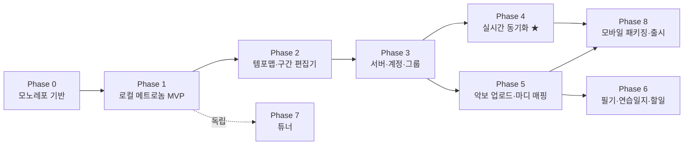

# FeelMyRythm 구현 로드맵

[설계문서](./DESIGN.md)를 실제로 구현하기 위한 단계별 계획. 각 단계는 **독립적으로 배포·검증 가능한 마일스톤**이며, "한 번에 전부"가 아니라 아래 순서대로 쌓아 올린다.

---

## 1. 왜 이 순서인가 — 의존성 그래프

원칙:

1. **P0 기능(템포맵·동기화)이 최단 경로에 오도록** 배치. 악보·일지는 그 뒤.
2. 타이밍 엔진(Phase 1)은 모든 것의 토대이므로 가장 먼저, 가장 단단하게. 여기서 품질이 안 나오면 이후 전부 무의미.
3. 동기화(Phase 4)는 서버·계정(Phase 3)이 선행돼야 하지만, **시계동기 수학 자체는 Phase 1부터 core 패키지에 순수 함수로 미리 작성·테스트 가능**.
4. 튜너(Phase 7)는 의존성이 없어 아무 때나 병렬 진행 가능 (기분전환용 사이드 트랙으로 적합).
5. 모바일 패키징(Phase 8)은 마지막이지만, **Capacitor 셸에서의 오디오 지연 스모크 테스트는 Phase 1 직후 1회 선행**한다(§6 리스크 참조 — 아키텍처를 뒤흔들 수 있는 리스크는 조기 검증).

---

## 2. 단계별 상세

> 기간은 1인 개발, 파트타임 기준의 감. 각 단계 끝의 **DoD(완료 기준)** 를 통과해야 다음 단계로.
>
> 모든 Phase의 DoD에는 문서 동기화가 포함된다. 앱의 코드·설정·스키마·UI·빌드·배포 동작이 바뀌면 해당 내용을 설명하는 기존 설계·기능·사용자·아키텍처·운영 문서를 같은 변경에서 함께 수정해야 한다. 관련 문서가 이전 동작을 설명한 채 남아 있으면 해당 Phase나 작업은 완료가 아니다.

### Phase 0 — 프로젝트 기반 (약 1주)

| 작업 | 내용 |
|---|---|
| 모노레포 | pnpm workspaces, `packages/{core,audio,ui,protocol}`, `apps/{web,mobile}` 골격. `apps/server`는 Python 프로젝트(uv + FastAPI) |
| 품질 도구 | JS: TypeScript strict, ESLint/Prettier, Vitest · Python: Ruff, mypy, pytest · GitHub Actions (lint+test 양쪽) |
| 디자인 토큰 | [UI 디자인 시스템](./UI_DESIGN.md)의 색·타이포 토큰을 Tailwind CSS 변수로 셋업 |
| 배포 파이프라인 | GitHub-hosted ARM64 runner가 web/server 이미지를 GHCR에 commit SHA로 발행하고, 제한 SSH 명령으로 RPi Compose를 갱신한다. Python·Node·nginx·uv·PostgreSQL base는 tag+digest로 고정하고 exact runtime tag를 push 전 실행 smoke한다. 운영 DB는 외부 `cksDB`의 전용 DB·계정을 사용한다. |
| PWA 보안 기반 | App mount 전 `fmr-api` fail-closed purge, versioned safe Service Worker 제어권 확인·구형 worker 종료·재-purge, Workbox/nginx API no-cache, 별도 upgrade E2E를 구성한다. |

**DoD**: `pnpm test`·`pnpm build`·`pytest` 가 CI에서 통과하는 빈 골격.

### Phase 1 — 로컬 메트로놈 MVP (2–3주) ★토대

| 작업 | 내용 (설계문서 참조) |
|---|---|
| core: 타임라인 | 단일 구간 한정 `TempoMap` → `expandTimeline`, `locate`, `buildCountIn` (§4.3) — **반복(jumps)은 이 단계에선 미구현, 타입만 정의** |
| audio: 엔진 | `AudioEngine` 인터페이스 + `WebAudioEngine`: Worker 타이머 + 룩어헤드 스케줄러 (§5.2), 클릭 샘플 4종 |
| UI: 비주얼 메트로놈 | 박 슬롯 + 채움 예측 큐 + 다운비트 강조 (§9), rAF는 오디오 클럭 기준. [UI 디자인 시스템](./UI_DESIGN.md) 적용 |
| 기본 조작 | BPM·박자표 설정, 탭 템포, 예비박 on/off, 볼륨, 강세 패턴, 설정 localStorage 저장 |
| 스모크 테스트 | **Capacitor 빈 셸에 웹 빌드를 넣고 iPhone 실기기에서 오디오 지연·화면꺼짐 동작 확인** (리스크 조기 검증) |

**DoD**:
- 30분 연속 재생에서 드리프트·지터 청감 무결 (녹음 후 파형 간격 검사로 확인).
- 백그라운드 탭에서도 클릭이 끊기지 않음.
- 단위 테스트: 타임라인 전개·locate 경계값 (못갖춘마디, 6/8 dotted-quarter 등).

### Phase 2 — 템포맵·구간 편집기 (2–3주) ★기능 2 완성

| 작업 | 내용 |
|---|---|
| core: 반복 전개 | `JumpDirective` 전체(도돌이·볼타·D.C./D.S./Coda) 지원하는 `expandTimeline` 완성 + 무한루프 검출 |
| core: seek | `seekPoint(measure, pass)` — "26마디 2번째 패스부터" 시작 지원 |
| UI: 편집기 | 구간 리스트 편집 + 마디 눈금 타임라인 뷰 (§4.4), native table 표 모드, 구간 분할/병합, 유효성 표시 |
| UI: 재생 | 마디 지정 시작, 현재 마디·구간 라벨·다음 변화 예고 표시, 재생 중 템포맵 수정 시 다음 마디 경계 반영 |
| 저장 | 템포맵 다건 로컬 저장(IndexedDB), JSON 내보내기/가져오기 (서버 전 임시 공유 수단) |

**DoD**: 사용자 시나리오 재현 — "♩=100 4/4 시작 → 26마디부터 ♩=130 → 도돌이 1st/2nd 엔딩" 템포맵을 편집기로 만들고, 임의 마디부터 예비박 포함 재생. 반복 전개 단위 테스트 통과.

### Phase 3 — 서버·계정·그룹·공유 (약 2주)

| 작업 | 내용 |
|---|---|
| 서버 | FastAPI + SQLAlchemy 2 + Alembic + PostgreSQL, JWT 인증 (이메일 + Google OAuth) |
| 도메인 CRUD | Group / Project / RepertoireItem / TempoMap(revision) — §8 스키마 |
| 클라 연동 | 로그인, 그룹·프로젝트·레파토리 화면, 템포맵 서버 저장·불러오기, 로컬↔서버 병합(단순 revision 우선) |
| protocol | Pydantic → OpenAPI → `openapi-typescript`로 TS 타입 자동 생성 파이프라인 (CI 검증 포함) |

**DoD**: 두 계정이 한 프로젝트에서 같은 곡의 템포맵을 공유·수정(revision 증가)할 수 있다.

### Phase 4 — 실시간 동기화 (3–4주) ★기능 3 완성, 최고 난도

| 작업 | 내용 |
|---|---|
| 서버 WS | FastAPI WebSocket 엔드포인트: Redis 공유 방 상태·presence TTL·분산 lock·pub/sub fan-out, `TransportState`, PING/PONG 권위 상태 복구 — uvloop, 수신 즉시 타임스탬프 기록 (§6.2–6.3) |
| core: 시계동기 | min-RTT 필터 offset 추정기 + 드리프트 평활 — **순수 함수로 작성, 시뮬레이션 단위 테스트** (지연 분포를 주입해 오차 검증) |
| 클라: 변환 체인 | serverTime → performance.now() → audioCtx time 매핑 유지 |
| 세션 UX | 방 개설/입장, 참가자 목록·RTT 표시, 리더 권한, "26마디부터 시작" → 전원 예비박 동기 시작. ready/start/stop은 acknowledgment/5초 timeout 전까지 pending으로 중복 전송을 막고, clipboard 실패 시 선택 가능한 초대 URL을 제공 (§6.4) |
| 캘리브레이션 | 탭 기반 기기 오프셋 측정 화면 + 기기·출력장치별 저장 (§6.5), 블루투스 경고 |
| 복원력 | 늦은 합류·재접속 시 다음 마디 경계 합류, WS 재연결 |

**DoD**:
- 같은 Wi-Fi의 기기 2대(+가능하면 3대: 폰/노트북 혼합)에서 동시 재생을 녹음 → 파형 클릭 간격 차 **±10ms 이내** (블루투스 제외, 캘리브레이션 후).
- 재생 중 한 기기의 네트워크를 끊어도 해당 기기 재생 지속.
- 시계동기 추정기 시뮬레이션 테스트: 지터 50ms 분포에서 offset 오차 < 5ms.

### Phase 5 — 악보 (3–4주) ★기능 4 + 기능 2의 "마디 세기"

| 작업 | 내용 |
|---|---|
| 업로드 | final과 분리된 presigned staging 업로드, PDF/이미지/MusicXML 타입 감지. complete는 멱등 promote 뒤 `ready`+staging 삭제 outbox를 원자 commit하고, stale pending reaper·late-write guard가 client 실패를 회수하며 악보 수는 `ready`만 집계 |
| MusicXML | 파싱 → 마디 수·박자표·템포·도돌이 추출 → **템포맵 초안 자동 생성** (§7.1), OSMD 렌더링 |
| PDF/이미지 | PDF.js 뷰어 + **수동 마디 매핑 도구**. pointer 좌표를 zoom과 무관한 score page surface 0–1 좌표로 저장 |
| 원자적 저장 | `PUT /scores/:id/settings`로 metadata와 MeasureMap을 revision 검증 후 함께 저장. 최초 map 생성도 Score parent lock, 경합은 rollback + 409 |
| 연동 | 마디 탭 → seek/동기 시작, 현재 마디 하이라이트·자동 페이지 넘김. 재생 중 수동 페이지 이동은 auto-follow 중지 + resume CTA |
| 파트보 | Score kind/instrument, 총보↔파트보 같은 마디 점프 (`measureNumberOffset`) |
| 입력·시맨틱 | 파트보는 `tablist`/roving tab index/화살표·Home·End로 선택. 펜·매핑은 현재 `pointerId`를 capture해 stylus와 2차 pointer를 혼합하지 않음 |
| 권한 | `/repertoire/:id/access` role로 leader/owner 전용 upload·metadata·map UI를 선제 제한하고 서버에서 재검증 |
| 오프라인 | IndexedDB schema v3의 `userId` 복합 키 store에 원격 템포맵·악보·map·주석·연습일지를 성공 응답 단위로 snapshot. 구형 unscoped remote row는 migration에서 폐기하고 network failure만 현재 사용자의 읽기 전용 fallback 허용 |
| compact UI | 좁은 화면의 악보 도구를 safe-area를 고려한 fixed bottom overlay로 배치하고 악보를 reflow하지 않음 |
| OMR 보조 | Audiveris 서버 OMR을 persistent background job으로 실행하고 PDF/이미지 마디맵 초안을 생성. 시작 revision을 고정하며 미리보기·명시적 저장 전에는 기존 맵을 변경하지 않음 |

**DoD**: MusicXML 업로드 → 마디 수 자동 인식·템포맵 초안 생성. PDF 업로드 → 10분 내 수동 매핑 완료 → atomic settings 저장·재생 하이라이트·파트보 점프 동작. network failure에서는 snapshot으로 열리고, 403/404/409/5xx는 캐시로 숨기지 않는다.

### Phase 6 — 필기·연습일지·할일 (2–3주, 기능 5)

| 작업 | 내용 |
|---|---|
| 필기 | 악보 벡터 오버레이 (펜/텍스트/셈여림 스탬프). `/repertoire/:id/annotations`의 measure anchor는 파트 간 재투영하고 page anchor는 원본 score에 유지. 개인/프로젝트 공유와 REST commit 이후 WebSocket fan-out, 재접속 DB snapshot 복구 (§7.3) |
| 연습일지 | 레파토리별 일지 (마크다운), 마디 위치 앵커 첨부 |
| 할일 | 일지·레파토리에 Todo (담당자·기한·완료), 프로젝트 대시보드에 집계 |

**DoD**: 일지에 "26마디 crescendo 주의" 메모를 마디 앵커로 남기면 악보 해당 위치에서 표시됨.

### Phase 7 — 튜너 (1–2주, 아무 때나 병렬 가능)

| 작업 | 내용 |
|---|---|
| 검출 | AudioWorklet + MPM/YIN (§10), 안정화 필터 |
| UI | 음이름 + 센트 바늘, A4 기준음 프리셋 (440/442/443/415) |

**DoD**: 기준 사인파 220–1760Hz에서 ±2센트 내 표시, 실악기(현·관) 청감 검증.

### Phase 8 — 모바일 패키징·출시 (2–3주)

| 작업 | 내용 |
|---|---|
| Capacitor | iOS/Android 프로젝트, 아이콘·스플래시, 딥링크(방 초대 링크) |
| 설치 첫인상 | PWA `id`/scope/start URL·`ko-KR`·category, 분리된 `any`/`maskable` PNG, Apple touch icon을 검증. 다크/라이트는 `theme-color`와 Capacitor SystemBars까지 동기화 |
| 네이티브 보강 | `NativeAudioEngine` 구현 완료: iOS AVAudioEngine/.playback session, Android Oboe low-latency callback/foreground media service, 전체 timeline batch·경계 취소. Keep-Awake와 Haptics도 동일 bridge 수명에 연결 |
| 지연 검증 | 실기기 매트릭스에서 Phase 4 DoD 재검증. iOS/Android 녹음 파형으로 화면 꺼짐·인터럽트·기기 간 ±10ms를 확인하고 calibration 값을 기록 |
| 출시 | TestFlight/내부 테스트 → 스토어 심사 |

**DoD**: 실기기 2대(iOS+Android)에서 화면 꺼짐 상태 포함 동기 재생 오차 기준 충족, 스토어 제출.

---

## 3. MVP 컷라인 (가장 빨리 실사용에 도달하는 선)

**Phase 0 → 1 → 2 → 3 → 4** 까지가 MVP. 이 시점에 "앙상블이 같은 템포맵으로 같은 순간에 예비박부터 시작"이라는 핵심 가치가 완성된다. 악보(5)·일지(6)·튜너(7)는 MVP 이후 사용자 피드백을 받으며 추가해도 된다. 앙상블 팀에 MVP를 먼저 써보게 하는 것을 강력 권장.

## 4. 테스트 전략

| 대상 | 방법 |
|---|---|
| 타임라인 전개 (반복·볼타·D.C.) | 순수 함수 단위 테스트가 주력. 악보 예제 케이스를 픽스처로 축적 |
| 시계동기 추정기 | 네트워크 지연 분포 주입 시뮬레이션 (결정론적 시드) |
| 오디오 타이밍 | 재생 녹음 → 클릭 온셋 간격 자동 분석 스크립트 (회귀 검사용) |
| 동기 오차 | 기기 2대 동시 녹음 → 파형 교차상관으로 오프셋 측정 (Phase 4 DoD 도구) |
| 서버 API/WS | pytest + httpx/WebSocket 테스트 클라이언트 (FastAPI 내장 지원) |
| UI/플로우 | Playwright: 편집기 시나리오, 방 개설→시작 (WS 목서버) |
| PWA upgrade | 구형 API-caching worker와 `fmr-api`를 실제 브라우저에 seed. safe worker 전환 중 legacy late write를 재현한 뒤 App mount 전 purge·network API 응답·manifest icon을 별도 Playwright 게이트로 검증 |
| 앱 셀·대규모 workspace | history POP scroll 복원·새 탐색 top·overlay close, leaf 동시성 6 상한, 일부 503에서 건강한 곡 유지·재시도를 단위/UI 테스트로 검증 |
| 악보 동시성 | Score parent lock, 최초 MeasureMap insert 경합, stale settings 409와 metadata/map transaction rollback을 PostgreSQL + API 테스트로 검증 |
| 악보 cache/UX | network error와 HTTP error 분기, IndexedDB v3 user partition/migration/snapshot, Service Worker 인증 API cache 부재, zoom 좌표, manual page resume, compact fixed overlay를 단위·Playwright 테스트로 검증 |
| 반응형·접근성 | [RESPONSIVE_UX.md](./RESPONSIVE_UX.md)의 viewport 매트릭스에서 route별 overflow·고정 UI 비가림·터치 타깃·키보드 순서 검증 |
| 런타임 이미지 | tag+digest로 고정한 base로 ARM64 image를 빌드한 뒤 exact publish tag의 server default CMD/Alembic/health/non-root/read-only 경계와 nginx config/SPA/header/API proxy를 실제 container로 smoke |

## 5. 리스크 관리 (검증 시점을 앞당긴 것들)

| 리스크 | 영향 | 대응·검증 시점 |
|---|---|---|
| WKWebView 오디오 지연/백그라운드 제약 | 아키텍처 재고 수준 | NativeAudioEngine 전체-timeline queue와 Android foreground service로 WebView timer 의존 제거. 실제 기기 파형 gate는 유지 |
| 블루투스 출력 지연 | 동기 체감 파괴 | 설계에 캘리브레이션·경고 내장 (Phase 4). 제거 불가능한 물리 제약으로 UX로 관리 |
| OMR(PDF 자동 인식) 정확도 | 기대 불일치 | 수동 매핑을 기본 경로로 설계, OMR은 초안 보조로만. Phase 5 후반에 별도 검증 |
| 반복 구조 엣지케이스 (D.S. al Coda 중첩 등) | 잘못된 전개 | 실제 악보 픽스처 테스트 축적, 편집기에서 전개 결과 미리보기 제공 |
| 1인 개발 범위 과다 | 지연 | MVP 컷라인(§3) 준수, Phase 5 이후는 피드백 기반 우선순위 재조정 |
